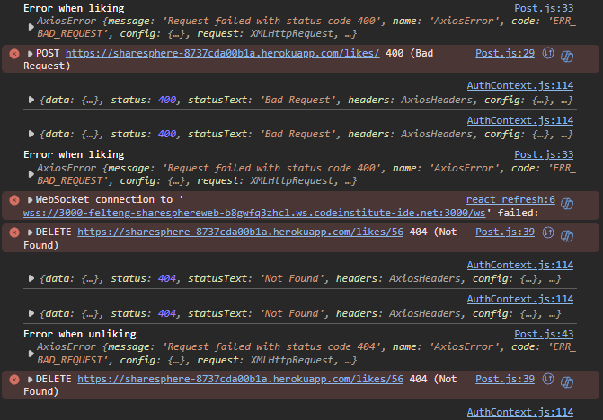

## Testing

refresh_token value was not available with httponly set to true on the backend

### Addressed bugs

- Refreshing the page gives a brief flash of a view as though the user isn't authenticated.

  - This leads to more than just an odd visual. It can also generate faulty API requests where the logged in users id is used, but before the AuthContext useEffect hook has set the loggedInUser state the loggedInUser.pk will = undefined.

    - So instead of making a get request to "/posts/?likes**owner**profile=1" we end up making a get request to "/posts/?likes**owner**profile=undefined" until the loggedInUser state has been set.

  - The solution to this is to store the user data in a loggedInUser local storage object and use that object as the defualt value for the loggedInUser state:
    ```js
    const [loggedInUser, setLoggedInUser] = useState(() => {
      const savedLogin = localStorage.getItem("loggedInUser");
      return savedLogin ? JSON.parse(savedUser) : null;
    });
    ```
  - The logic used for managing the loggedInUser object:

    ```js
    useEffect(() => {
      const verifyLogin = async () => {
        const data = await checkLoginStatus();
        const savedLogin = localStorage.getItem("loggedInUser");

        if (!savedLogin && data) {
          setLoggedInUser(data);
          localStorage.setItem("loggedInUser", JSON.stringify(data));
        } else if (savedLogin && !data) {
          setLoggedInUser(null);
          localStorage.removeItem("loggedInUser");
        } else if (savedLogin && data && savedLogin !== data) {
          setLoggedInUser(data);
          localStorage.setItem("loggedInUser", JSON.stringify(data));
        }
      };
      verifyLogin();
    }, []);
    ```

  - A request will still be made on mount to ensure that the user should still have access and if they don't then the localStorage object is managed accordingly.

- Repeatedly clicking the like button on a post leads to faulty duplicate requests and error spam in console.

  

  - This is because clicking the button will keep triggering the function that handles the API request even if a request is alreadt being made.

  - The solution to the problem is simply to disable the functions from trying API requests if one is in progress.

    - This was done by adding a new useState hook and and using it's condition for the like and unlike functions:

    ```js
      * const [loading, setLoading] = useState(false); *

      const handleLike = async () => {
        * if (loading) return; *
        * setLoading(true); *
        try {
          const { data } = await axiosRes.post("/likes/", { post: id });
          setLikeCount(likeCount + 1);
          setLike(data.id);
        } catch (error) {
          console.log("Error when liking", error);
        } finally {
          * setLoading(false); *
        }
      };

      const handleUnlike = async () => {
        * if (loading) return; *
        * setLoading(true); *
        try {
          await axiosRes.delete(`likes/${like}`);
          setLikeCount(likeCount - 1);
          setLike(null);
        } catch (error) {
          console.log("Error when unliking", error);
        } finally {
          * setLoading(false); *
        }
      };
    ```

### Unaddressed bugs

- Whenever a comment, a post, or a reply that is part of a page that has a next value is deleted the amount of objects deleted will be missed when fetching the next page.

  - For example a post with 17 comments would have 2 comments on the next page for infinite scroll to fetch when needed, but if I delete 2 of my comments from the first page of 15 comments those 2 comments on the next page will have moved to the first page on the backend, but when infiniteScroll tries to fetch the next page they will not be there and will therefore not be rendered.

    - I haven't landed on a specfic solution for it that would keep the neat responsive flow of react rendering.

      - A possible fix would be to fetch the first object on the next page before performing the deletion.

## Credits

### Media

<a href="https://www.freepik.com/free-vector/illustration-uploading-icon_2609994.htm#fromView=search&page=1&position=2&uuid=9be541e0-fa06-4684-9405-d17041835be8" title="freepik upload vector">Image upload icon vector</a>

<a href="https://www.flaticon.com/free-icons/picture" title="picture icons">Default post icon created by Freepik - Flaticon</a>

<a href="https://www.logoai.com/icon-generator" title="icon generator">Site favicon generated with logoai</a>

### Technical
