# ShareSphere

Welcome to ShareSphere, a dynamic and interactive platform designed for seamless media sharing and social networking. With ShareSphere, you can create and share posts that include images, titles, and content, making it easy to express yourself and share your moments with the world. Our app allows you to like posts, follow other users, and leave comments to engage with the community. Connect more deeply with private conversations and explore user profiles to discover more about your fellow ShareSphere members. Join ShareSphere today and be part of a vibrant and connected community. \
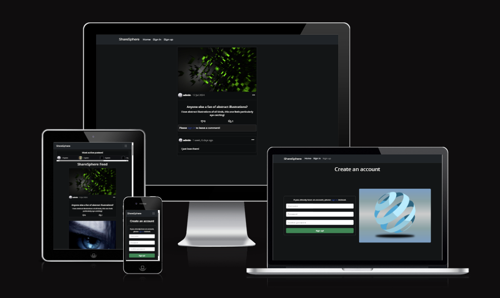

[Link to live site](https://sharesphere-web-9f70d26dc82a.herokuapp.com/)

## Table of Contents

- [UI/UX](#uiux)
  - [Agile](#agile)
  - [Wireframes](#wireframes)
  - [Site Goals](#site-goals)
  - [5 Planes of UX](#5-planes-of-ux)
  - [Visual Design Ideology](#visual-design-ideology)

- [Features](#features)
  - [Current Features](#current-features)
  - [Future Features](#future-features)
  - [CRUD Features](#crud-features)

- [Technologies Used](#technologies-used)
  - [Environments](#environments)
  - [JavaScript Libraries and Packages](#javascript-libraries-and-packages)
  - [React Packages and Components](#react-packages-and-components)
  - [ESlint Configs](#eslint-configs)
  - [Other Libraries and Packages](#other-libraries-and-packages)

- [Testing](#testing)
  - [Test Guide](#test-guide)
  - [Validator Testing](#validator-testing)
  - [Browser Testing](#browser-testing)
  - [Addressed Bugs](#addressed-bugs)
  - [Unaddressed Bugs](#unaddressed-bugs)

- [Deployment](#deployment)
  - [Local Deployment](#local-deployment)
  - [Live Deployment](#live-deployment)

- [Development](#development)
  - [Clone](#clone)
  - [Fork](#fork)
  - [Download as ZIP](#download-as-zip)

- [Credits](#credits)
  - [Technical](#technical)
  - [Media](#media)
  - [Honorable Mentions](#honorable-mentions)

## UI/UX

- UI

  - The overall look and design of ShareSphere aim to create a calm and visually pleasing experience. This is achieved by utilizing a clean, modern design with an intuitive layout that is easy on the eyes.

  - The dark theme and carefully selected color palette enhance readability and reduce eye strain, while maintaining a stylish and contemporary feel.

  - Layout, responsiveness, and navigation follow familiar patterns to ensure users can effortlessly navigate the site without confusion, providing a seamless and intuitive experience.

- UX

  - Interactivity is a core focus of ShareSphere, promoting rich user-to-user engagement through features such as likes, comments, and follows.

  - The design ensures a fluid experience when interacting with posts and comments. By utilizing react and react states any operation performed can be instantly reflected to the user, like editing or deleting a comment updating the list of comments already rendered.

  - ShareSphere provides a responsive and adaptive user interface that works seamlessly across all devices, ensuring that users have a consistent experience whether they are on a desktop, tablet, or mobile device.

  - Navigating different types of content is intuitive and easy. The user may simply infinitely scroll until there is no more content to display. This goes for posts, comments, conversations, and conversation replies.

### Agile

The entirety of this project has been built utilizing the agile development approach. The agile approach, combined with GitHub projects, has served as a tool that has helped visualize, plan, and execute different phases of the project development. The [GitHub project](https://github.com/users/Felteng/projects/4) created for this project features a kanban board where the various issues and their status can be seen. This backend application's repository as well as the backend API repository share the same project board to ensure a seamless integration of development between the two.

To view the user stories set out for this project please refer to the project link in the above paragraph. By clicking on any user story on the board a detailed view containing the user story and its acceptance criteria will be made visible. All the issues on the kanban board have received different labels to convey things like relevancy and importance. Frontend and backend related issues have their own separate labels and issues may be filtered as such.

### Wireframes

The initial Balsamiq wireframes are very simplified mockups of site layout to help steer development and design.

<details>
    <summary>
        Wireframes
    </summary>
    
    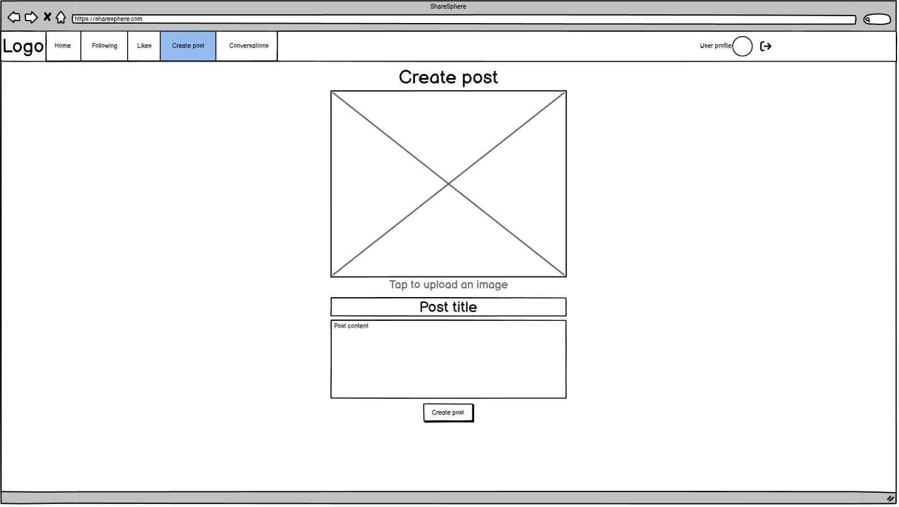
    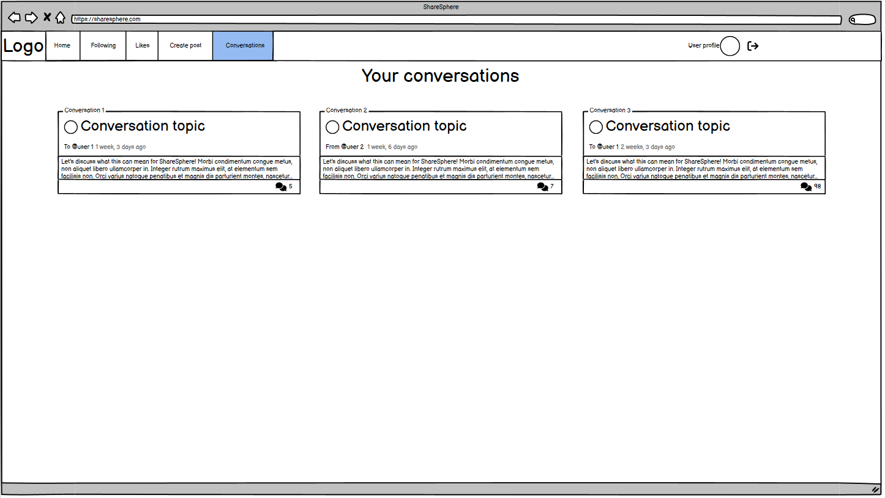
    
</details>

### Site Goals

ShareSphere aims to create a vibrant and engaging platform for individuals who love to share and connect through media. The primary purpose is to provide a space where users can effortlessly share their thoughts, experiences, and creativity with others. Targeting a diverse demographic ranging from casual social media users to avid content creators, ShareSphere intends to foster a community-driven environment that emphasizes interaction and connection. By enabling features such as posting, liking, commenting, and following, we strive to cultivate meaningful interactions and relationships among users.

### 5 Planes of UX

### 1. Strategy

**Objectives**

- **Primary Goal**: Create a community hub for media enthusiasts where users can share posts, images, and content, engage with others through comments and likes, and follow other users.

- **Secondary Goal**: Provide a seamless and interactive platform that fosters user engagement, creativity, and meaningful connections among users.

**User Needs**

- **Post Sharing**: Users need an easy way to create and share posts with images, titles, and content.

- **Engagement Tools**: Users need features like likes, comments, and the ability to follow other users to interact and connect.

- **User Profiles**: Users need detailed profiles to share more about themselves and view other users' profiles.

- **Private Conversations**: Users need a private conversation feature to communicate directly with each other. When editing the profile the user may opt out of conversations being sent to them.

### 2. Scope

**Functional Requirements**

- **Post Creation**: Functionality to create and share posts with images, titles, and content.

- **Engagement Features**: Ability to like, comment on posts, and follow other users.

- **User Profiles**: Detailed user profile pages displaying post count, followers, following information, biography, name if provided, and the ability to start a conversation.

- **Private Messaging**: Private conversation feature to facilitate direct communication between 2 users.

- **User Authentication**: Registration and login functionality to access personalized features.

**Content Requirements**

- **Home Page**: Introduction to what the site offers, a feed of recent posts, and options to interact with posts.

- **Following Page**: A feed of recent posts by users followed by the logged in site user.

- **Likes Page**: A feed of posts liked by the logged in site user.

- **Profile Page**: User information, amount of posts created by the user, followers, following details, biography, and name if given.

- **Post Details Page**: Detailed view of individual posts with the ability to leave comments.

- **Conversations Page**: List sorted by most recent conversations the logged in user is engaged in.

- **Conversation Details Page**: Detailed view of an individual conversation with all its replies and the ability to leave replies.

### 3. Structure

**Interaction Design**

- **Home Page**: Users are greeted with a feed of the latest posts.

- **Create Post Page**: A logged in user can access the create post page from the navbar with a straightforward post creation form.

- **Profile Page**: Users can view and edit their profile, see their post amount, followers, following count.

- **Post Details Page**: Users can view detailed information about a post, leave comments, and see other comments.

- **Conversations Page**: A straightforward interface for users to view and manage their private conversations and replies.

- **Starting Conversations**: A simple interface modal accessed by clicking the envelope/message icon when visiting another users profile.

**Information Architecture**

- **Navigation**: Clear and intuitive navigation bar with links to Home, Following, Likes, Create post, Profile, and Conversations.

**Content Hierarchy**:

- **Home Page**: Recent posts feed, with the most active posters visible.

- **Profile Page**: User information, user’s post count, followers count, and following count.

- **Post Details Page**: Post content followed by the comments section.

- **Create Post Page**: Form containing image input, post title, and post content fields with a submit button.

- **Conversations Page**: Feed of recent conversations with topic, content, replies count, sender information.

- **Conversation Details Page**: Conversation content followed by the reply section.

### 4. Skeleton

**Layout**

- **Home Page**: Header with navigation, main content area displaying recent posts, list of active posters, and infinite scroll.

- **Profile Page**: Header with navigation, main content area showing user details and stats, start conversation icon/edit profile icon.

- **Post Details Page**: Header with navigation, main content area for post details and comments, choosing to edit post converts the post into a form for editing.

- **Create Post Page**: Header with navigation, main content area for create post form.

- **Conversations Page**: Header with navigation, main content area for recent conversations.

- **Conversation Details Page**: Header with navigation, main content area for conversation details and replies.

**Interface Elements**

- **Buttons**: Clear call-to-action buttons for navigation, post creation, liking, commenting, replying, following, unfollowing, and CRUD actions where available.

- **Forms**: Simple forms for user authentication, post creation, comment submission, and reply submission.

- **Links**: Clearly labeled links for navigating to profiles, post details, and starting conversations.

**Navigation**

- **Top Navigation Bar**: Persistent across all pages with links to Home, Feeds, Post creation, Profile, and Conversations.

  - Links to home, sign in, and sign up for a signed out user.

- **Authentication Prompts**: Clear links to sign in and sign up pages with appropriate redirection after authentication.

### 5. Surface

**Visual Design**

- **Color Scheme**: A modern and calming color palette with dark themes and contrasting off-white text for accessibility.

- **Typography**: Clean, readable fonts for headers and body text to ensure clarity and legibility.

- **Imagery**: High-quality images for posts to enhance visual appeal and engagement.

**Branding**

- **Logo**: Prominently display the ShareSphere name/logo in the header for consistent branding.

- **Consistency**: Maintain a uniform look and feel across all pages with consistent colors, fonts, and button styles.

**User Feedback**

- **Interactivity**: Real-time updates for likes, comments, posts, replies, and follows to provide an engaging experience.

- **Notifications**: Alerts for successful or failed actions that may otherwise be unclear, such as authentication, starting a conversation with another user, etc..

- **Authentication Status**: Clear indication of the user’s authentication status in the header navigation bar.

### Visual Design Ideology

**Color Scheme:**

- The base scheme of the site is built with "dark theme" in mind as it's a theme becoming increasingly popular and tends to be a lot easier on the eyes for the user. There is not sacrifice in contrast or user experience to achieve the darker aesthetic. The goal is to provide a friendly looking interface that won't appall the user from using the site for any extended periods of time.

- To achieve the darker theme every page features shade of woodsmoke as the background. \
  

- The navbar aims to contrast the woodsmoke background with a more shark-like color and stand out a bit more as a call to action for navigation. The color for the nav links is more grey shade of white to ensure the visibility is in line with the WCAG standards. \
   \
  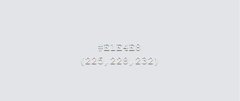

- The follow button to follow a user features a fiord blue color which provides a clear call to action when paired with the dark woodsmoke color whilst still fitting the calm overview of colors. \
  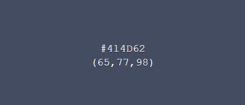

- All the main content text elements feature an ever so slightly off-shade of white which simply provides a good contrast against the dark background \
  

**Fonts:**

- Montserrat

  - The Montserrat font has been used in the navbar elements as well as the heading for most active posters. It's featured across various smaller elements like the profile name and join date. This font is chosen for its clean, modern appearance and excellent readability, which ensures that essential navigational and informational elements stand out clearly to users. Its geometric style conveys a professional feel, enhancing the overall user experience by making text easy to scan and aesthetically pleasing.

- Open Sans

  - The Open Sans font is used across most other elements and user-created content, with different font weights to convey the difference, for example, in a title. This font is chosen for its versatility and readability, making it ideal for body text and longer passages. Its clean and friendly appearance ensures that user-generated content is easy to read and engage with, while the variety of font weights allows for clear distinctions, enhancing the overall visual structure and user experience of the application.

- sans-serif
  - sans-serif is utilized as the fallback font in the event that the google fonts import would seize to function.

**Images:**

- Standardized imagery does not see a lot of use throughout this project, the focus lies heavily in user-posted imagery.

  - 2 simple default images are used for new users, and the other one for posts that have not had a custom image added to them.

  - A standard image upload icon is present for the post creation form.

  - Lastly there are 2 different illustrations of a sphere used as a feature image for the sign up and sign in pages respectively. They are present on tablet sizes and larger with the purpose of simply filling out some of the space on the pages.

**Icons:**

- Icons are featured and serve great purpose with intents to convey action without the need for long descriptions or buttons with text. The icon usage ranges from everything from a heart icon for liking posts to a right from bracket for logging out for larger screen navbars.

  - Icons can be found, but not limited to, profile pages where they convey message creation and enforce the name and join data info, on conversations where they convey reply count, and on posts where they convey like and comment count. \

    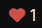
    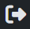
    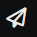
    
    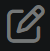 \
    A few examples of icons that may be found on the website.

## Features

### Current Features

- **Navigation**

  - Visible on every page of the application.

  - Navbar with navigation links to the various pages on the site as well as the logo/name.

  - Slightly different navigational links depending on whether the user is authenticated or not.

  - Current page is highlighted with a slightly more mute tone of white.

  - On mobile devices the navbar turns into a collapsible menu through the intuitive and very familiar burger menu toggle.

  - Features the logged in users avatar on larger screens with a logout icon next to it.

    - The profile button is just a nav link that says "Profile" on smaller screens with an expanded navbar.

      <details>
      <summary>
          Navigation images
      </summary>
      <p></p>
      <p></p>
      <p></p>
      </details>

- **Home page**

  - Features a "ShareSphere Feed" heading clearly indicating that the users is presented with a feed of content.

  - Features the most recent posts made by other site users.

  - Features a list of the 10 most active posters, ie users with the most posts.

  - The feed utilizes the very modern infinite scroll approach.
      <details>
      <summary>
          Home page images
      </summary>
      <p>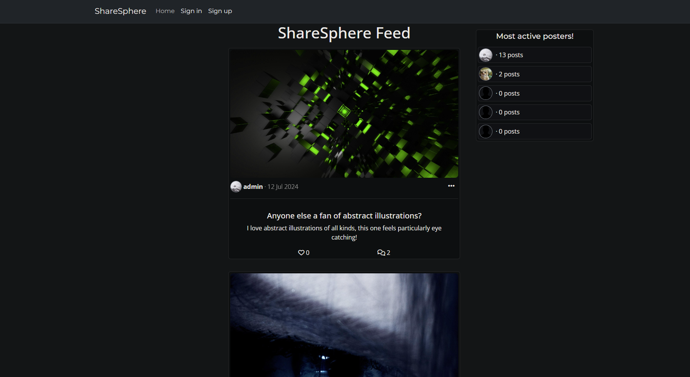</p>
      <p>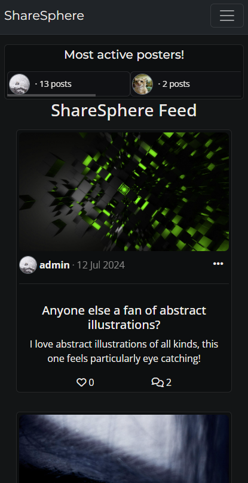</p>
      </details>

- **Feeds**

  - For signed in users 2 more feeds become available in addition to the home page main feed.

    - The following page/feed.

      - The following feed is a feed of the newest posts by users the logged in user follows.

    - The likes page/feed.

      - The likes feed is a feed of posts the logged in user has liked.

- **Most active posters**

  - Featured on all the different feed pages, home, following, and likes.

  - Shows 10 users with the most posts made on the application.

  - On smaller devices it's featured above the feed with a horizontal scroll.

- **Sign up page**

  - Features an ordinary registration form with a feature image and appropriate feedback if fields are left empty or with invalid input.

  - Upon registration the user is automatically signed in to the registered account and taken the home page.

    <details>
    <summary>
        Sign up images
    </summary>
    <p></p>
    <p>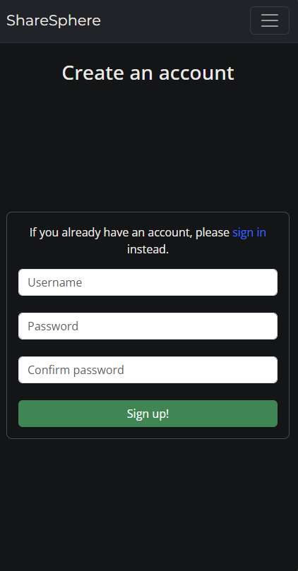</p>
    </details>

- **Sign in page**

  - Features a simple sign in form with a feature image and appropriate feedback if fields are left empty or with invalid input.

  - On successful sign in the user will be redirected to the home page, and now see a different looking navbar for authenticated users.

    <details>
    <summary>
        Sign in images
    </summary>
    <p></p>
    <p>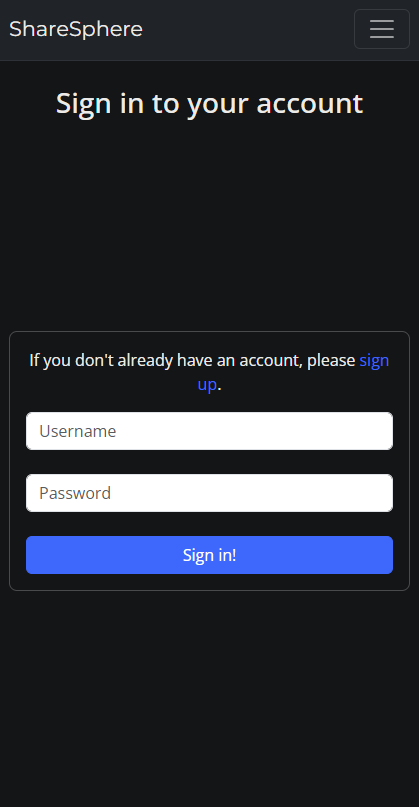</p>
    </details>

- **Sign out modal**

  - Tapping the sign out icon or the sign out navlink opens a sign out modal.

    - Features 2 simple buttons to sign out or to cancel the action.

      - Clicking cancel will close modal.

  - On successful sign out the user will be redirected to the home page with a success message.

    <details>
    <summary>
        Sign out image
    </summary>
    <p>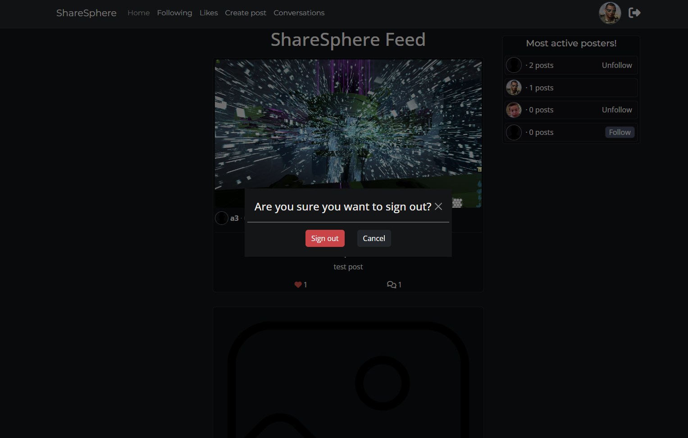</p>
    </details>

- **Create post page**

  - Features a 3 field form for creating a post.

  - Only the title field is required. It is limited to 50 characters.

  - The content field is limited to 200 characters.

  - A missing title or an image that is too large will generate and display field errors for the respective fields.

  - Successfully creating a post redirects the user to the newly created post.
      <details>
      <summary>
          Post creation images
      </summary>
      <p>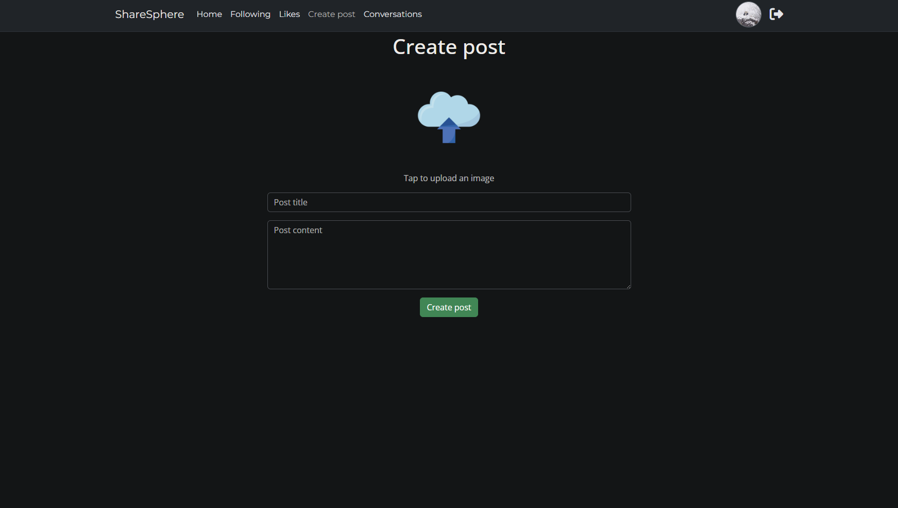</p>
      <p></p>
      <p>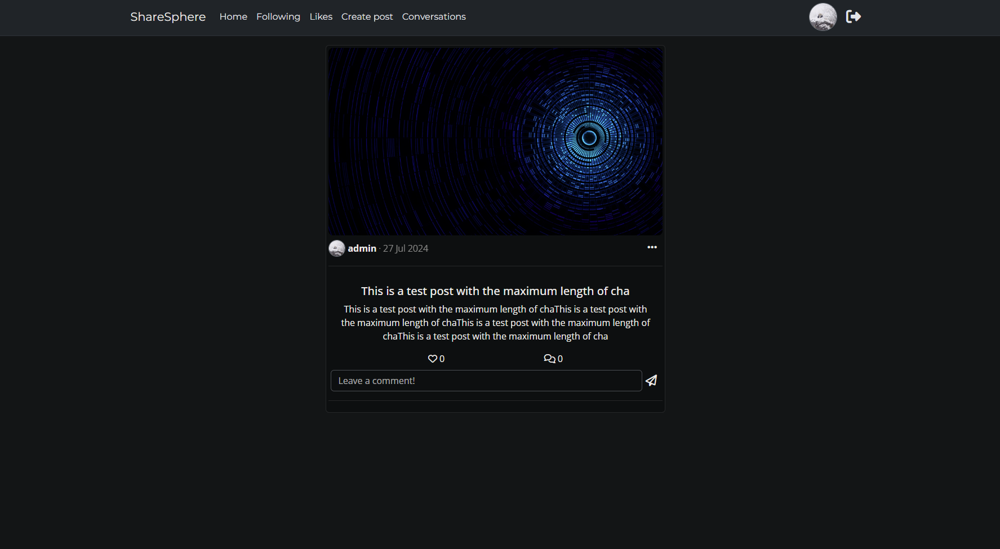</p>
      </details>

- **Post editing and deleting**

  - If the logged in user is the owner of a post clicking the 3 dots presents an edit and a delete option.

  - Clicking edit toggles the post to turn into a post form with the fields populated with the post content.

    - The post can be toggled back from editing by clicking the cross where the three dots previously were.

    - The edit form shows field erros the same way the creation form does.

    - Confirming the post update will update the post content in the post page or in the post feed.

  - Clicking delete brings up a post delete confirmation modal.

    - The modal may be closed if the user wishes not to delete the post.

    - If the post is deleted from a feed of posts the modal will close and the post will be removed from the feed.

    - If the post is deleted from its post page the user will be redirected to the home page with an alert letting the user know the deletion was successful.

    <details>
    <summary>
        Post edit/delete images
    </summary>
    <p></p>
    <p>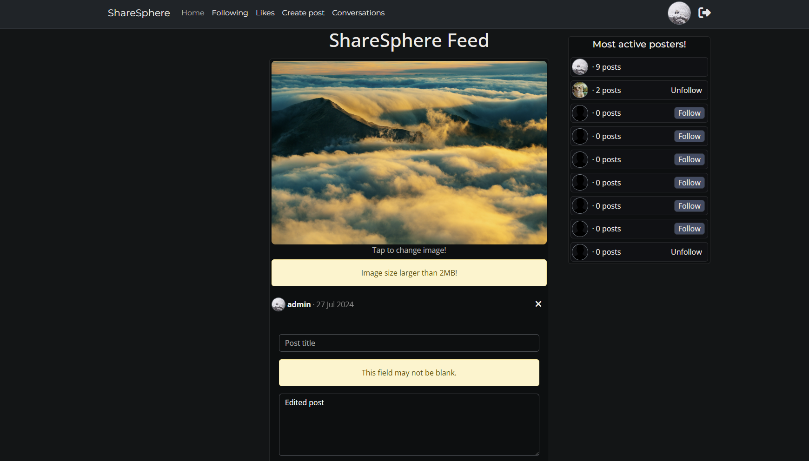</p>
    <p>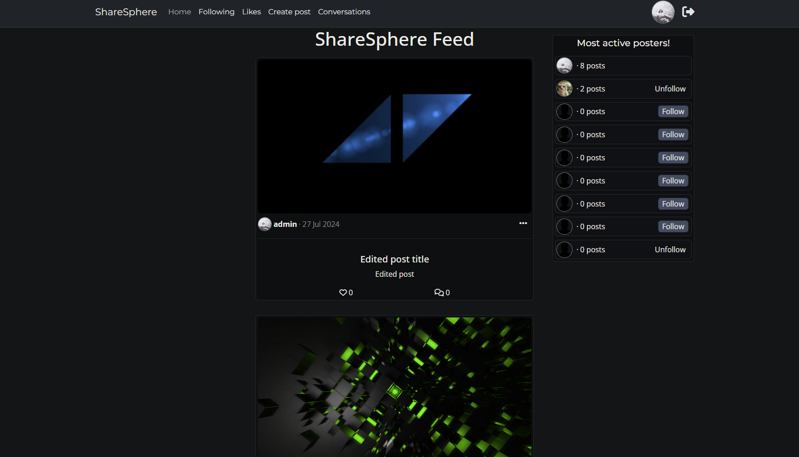</p>
    <p>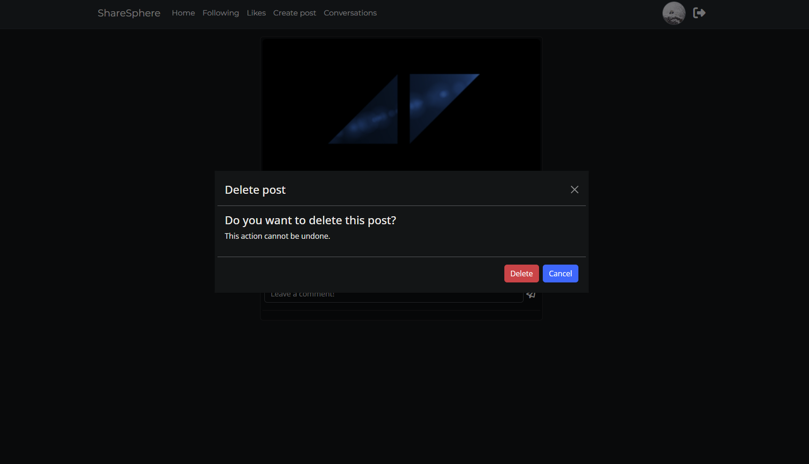</p>
    <p>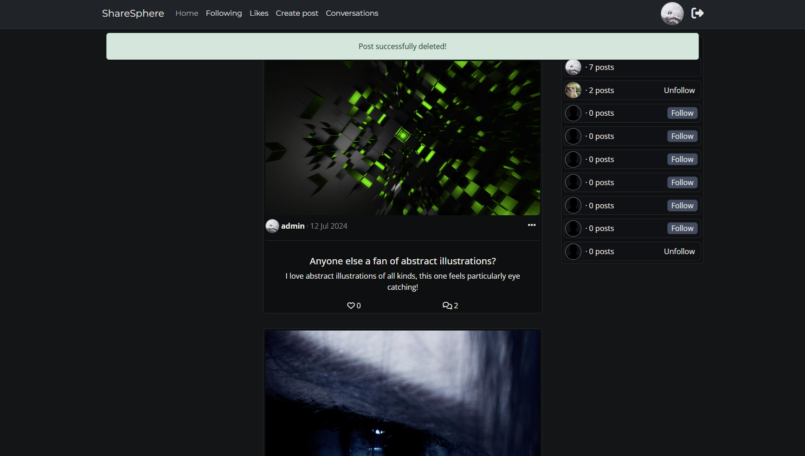</p>
    </details>

- **Creating comments**

  - Comments can be created under any post when visiting the post page.

  - Attempting to submit an empty comment shows a tooltip notifying the user to provide a comment first.

  - Successfully submitting a comment will add it to the feed of comments under the post.
      <details>
      <summary>
          Create comment images
      </summary>
      <p>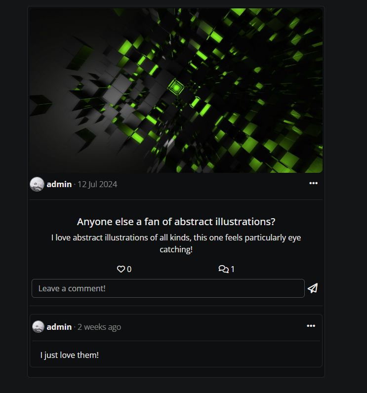</p>
      <p>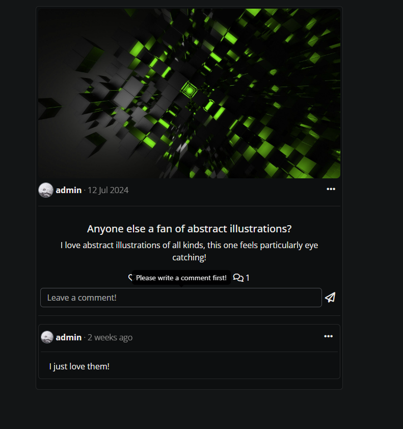</p>
      <p>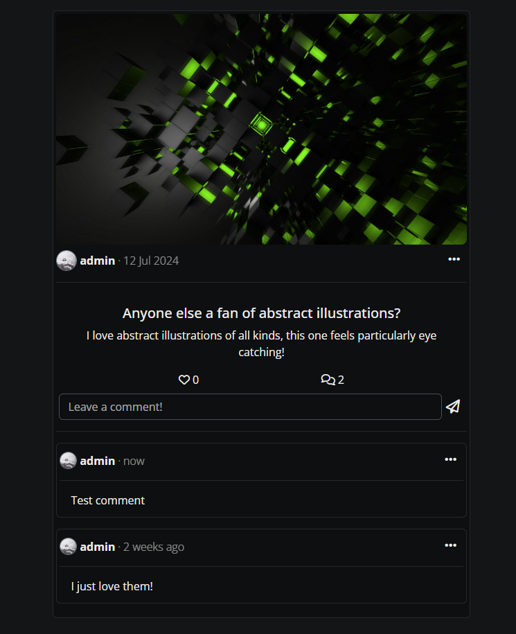</p>
      </details>

- **Comment editing and deleting**

  - If the logged in user is the owner of a comment clicking the 3 dots presents an edit and a delete option.

  - Clicking edit toggles the comment to turn into a comment form with the field populated with the comment's content.

    - The comment can be toggled back from editing by clicking the cross where the three dots previously were.

    - The edit form shows the same tooltip if the comment is empty when submitted.

    - Confirming the comment update will update the comment content and toggle away from the editing form.

  - Clicking delete brings up a comment delete confirmation modal.

    - The modal may be closed if the user wishes not to delete the comment.

    - If the comment is deleted the modal will close and the comment will be removed from the feed of comments.

    <details>
    <summary>
        Comment edit/delete images
    </summary>
    <p></p>
    <p></p>
    <p>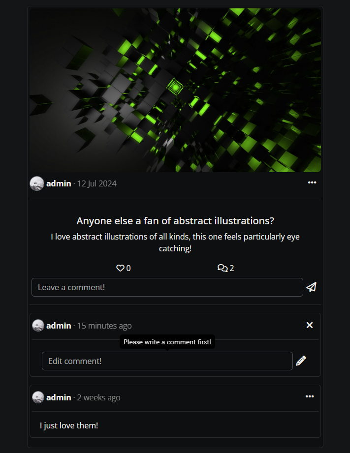</p>
    <p>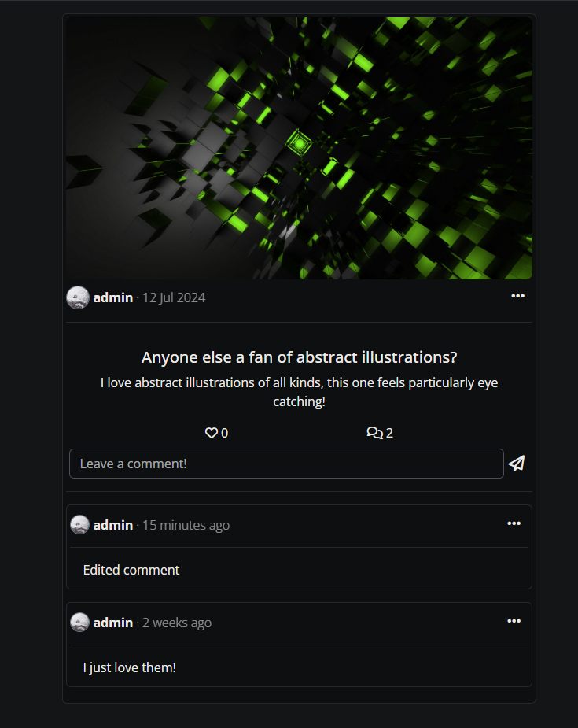</p>
    <p>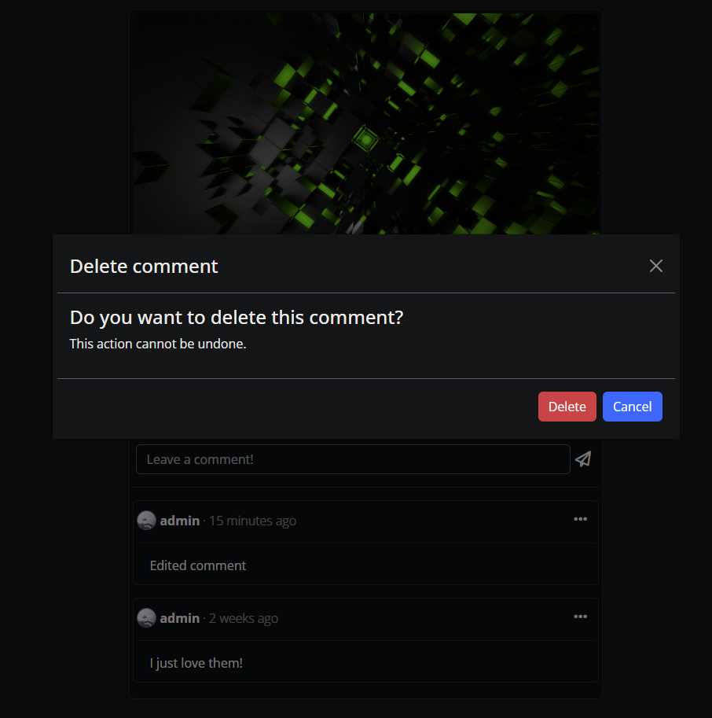</p>
    <p></p>
    </details>

- **Action response alerts**

  - When certain actions get completed that may otherwise be unclear if they were successful or not response messages are displayed.

  - The alerts close automatically after 4 seconds.

  - An example of this has already been shown when deleting a post from the post page.

  - They may also appear if a logged in user tries to visit the sign in or sign up page. Or when the user signs out.

  - They appear in other cases as well, most of which will be shown with other features.
      <details>
      <summary>
          Response message images
      </summary>
      <p></p>
      <p></p>
      <p>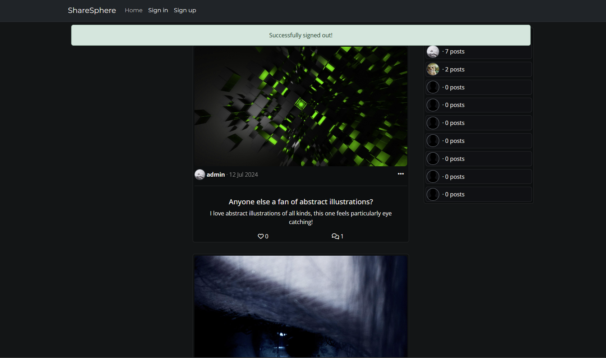</p>
      </details>

- **Unauthorized request handling and alerts**

  - If an unauthorized user tries to visit a page that requries authorization they will be redirected to the sign in page with an alert.

    - Performing such a request would be done through editing the url manually, like visiting /conversations when signed out.

  - If a user's session has expired, and they try to perform an action that requires sign in they are redirected with an alert.

      <details>
      <summary>
          Warning alerts when signed out
      </summary>
      <p>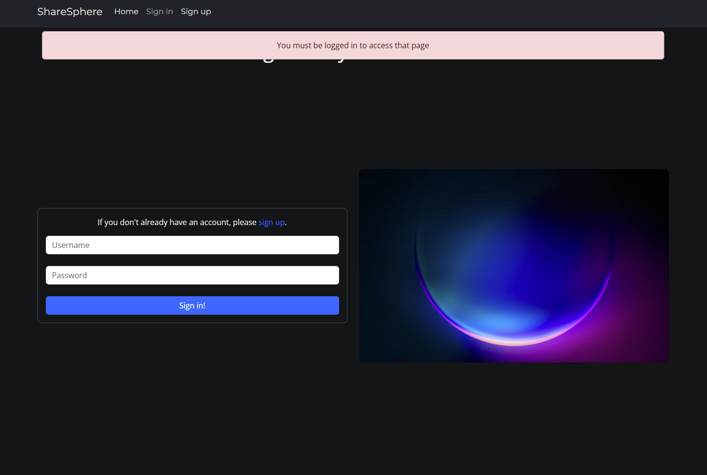</p>
      <p></p>
      </details>

- **Conversations**

  - Logged in users have access to the conversations page.

  - The conversations page features a list of conversations the user is part of.

    - The avatar displayed on the conversations in this list will always be that of the opposite user, since it's safe to assume the logged in user will be the other user of the conversation.
    - The name of the other user will also be displayed with "to" or "from" added in front of the name to indicate who started the conversation.

  - Clicking on the content of a conversation opens that conversation page where replies can be made and read.

  - If the user isn't part of any conversations a message is displayed describing that.

  - The overflow of the message is replaced by "..." indicating that you should open the conversation to read more.

      <details>
      <summary>
          Conversations images
      </summary>
      <p></p>
      <p></p>
      </details>

- **Creating a conversation**

  - Visiting another users profile as a logged in user will show a message/envelope icon.

  - Clicking that icon toggles a conversation creation modal with a simple form to start a conversation with that user.

  - Both the topic and message fields are required. The topic is limited to 40 characters and the message is unlimited.

  - Failing to populate the fields displays field erros for the respective fields.

  - Successfully creating a conversation closes the modal and displays an alert letting the user know they were successful.

  - Visiting the conversations page will now display the newly created conversation.

      <details>
      <summary>
          Conversation creation images
      </summary>
      <p>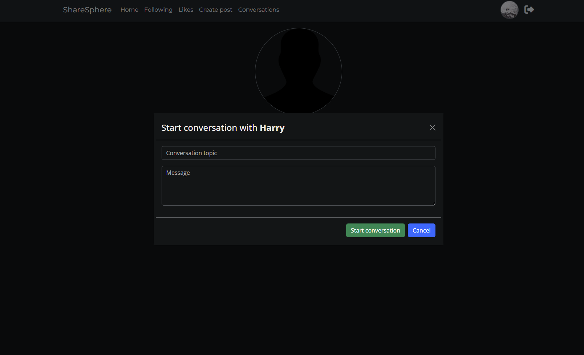</p>
      <p></p>
      <p>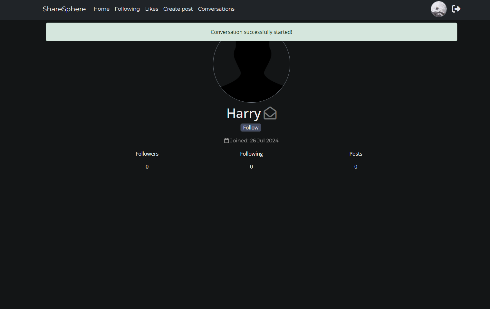</p>
      <p>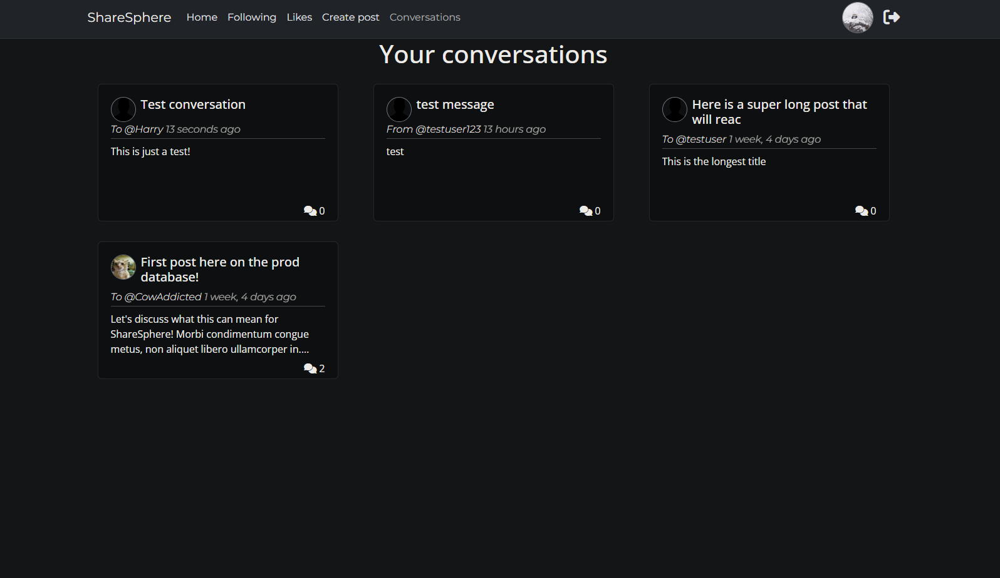</p>
      </details>

- **Conversation page**

  - Clicking on the content of a conversation opens the conversation page.

  - The conversation page will show the avatar of the conversation creator as well as any overflowed content.

  - The reply creation form and replies made can be found on this page too.

  - On this page the three dots for the dropdown is also visible.

    - Why it's only visible here and not in the conversations overview list is because the intention is for the user to be aware of which post they would be deleting.

    <details>
    <summary>
        Conversation page images
    </summary>
    <p>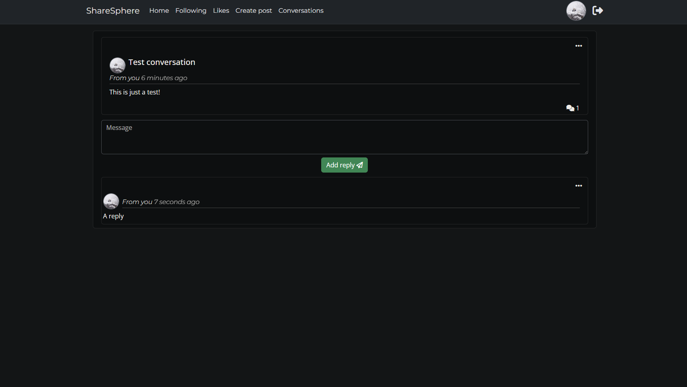</p>
    </details>

- **Deleting a conversation**

  - The three dots dropdown menu is visible for the owner of a conversation when opening the conversation page, and not in the list of conversations.

    - This is to ensure that the owner is sure of which conversation they will be deleting.

  - Conversations can only be deleted and not edited, the same goes for replies

    - This is to avoid any malicious editing to be done to make a conversation look like something it never was.

  - Clicking the delete option in the dropdown opens a delete confirmation modal.

  - The modal may be closed if the user does not want to delete the conversation.

  - Clicking delete will close the modal, delete the conversation, and redirect the user to the conversations list with a success message.

    <details>
    <summary>
        Conversation deletion images
    </summary>
    <p></p>
    <p></p>
    <p></p>
    </details>

- **Creating replies**

  - The reply form is directly visible when opening a conversation.

  - It's a 1 field form simiar to the comment form.

  - There is not limit to the length of a reply.

  - Submitting an empty reply displays an error for the field.

  - Submitting a reply updates the reply count and adds the reply to the list of replies in the conversation.

    <details>
    <summary>
        Replies images
    </summary>
    <p></p>
    <p>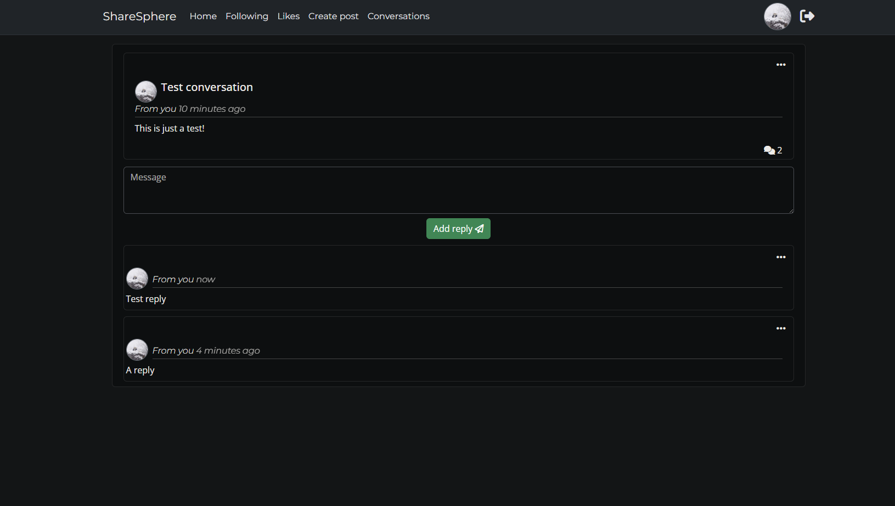</p>
    </details>

- **Deleting replies**

  - Replies can only be created and deleted.

  - Clicking the three dots dropdown menu will show the delete option.

    - The dropdown is only available for the reply owner.

  - Clicking the delete option opens a delete confirmation modal.

  - The modal may be closed if the user does not want to delete the reply.

  - Clicking delete will close the modal and delete the reply and update the reply list and count accordingly.

    <details>
    <summary>
        Replies deletetion images
    </summary>
    <p></p>
    <p></p>
    <p>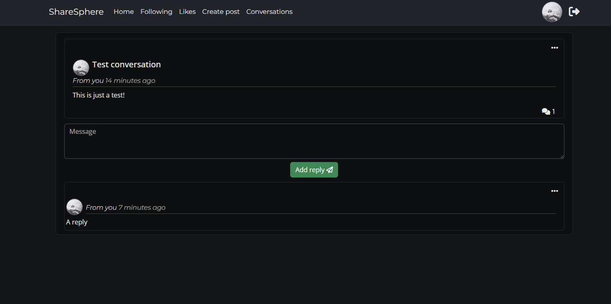</p>
    </details>

- **Profile page**

  - The profile page features the profile owners avatar, username, bio, name and bio (if provided), join data, post count, follower count, and followers count.

  - The owner of a profile will see an edit icon next to their username.

    - This is to access the profile edit page.

  - visiting another users profile as a logged in user, assuming the user hasn't disabled receive_messages, an envelope/message icon will appear next to the username.

    - This is used to start a conversation with the user.

    <details>
    <summary>
        Profile images
    </summary>
    <p>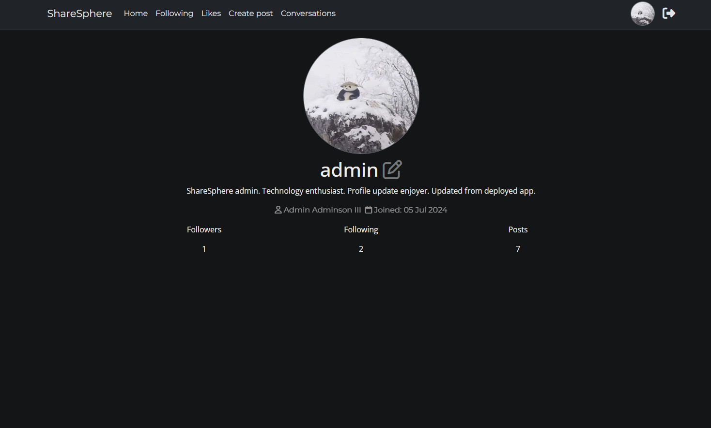</p>
    <p>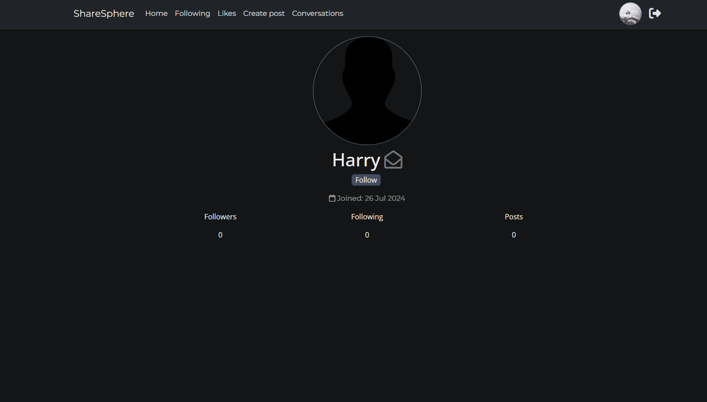</p>
    <p></p>
    <p>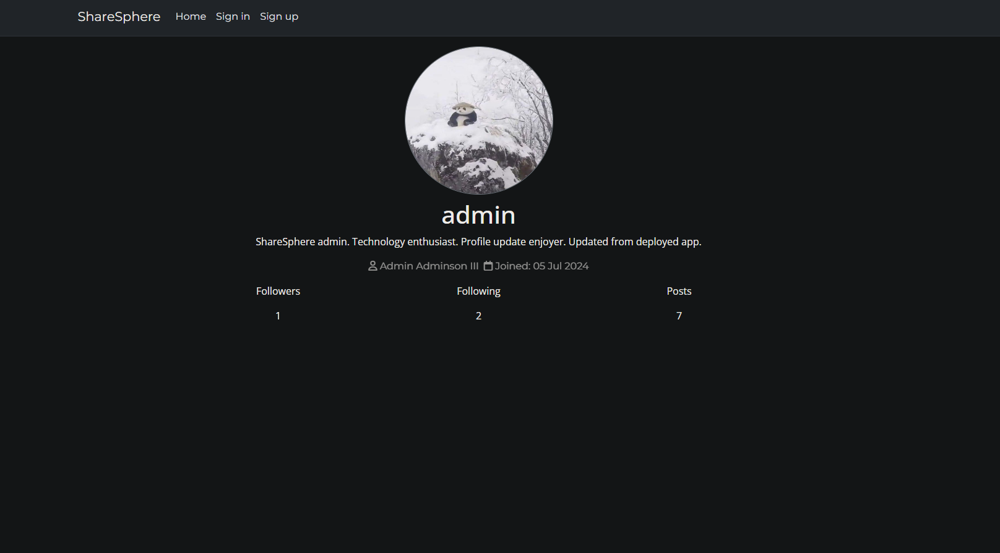</p>
    </details>

- **Profile editing**

  - Clicking the edit button on your own profile takes you the profile editing page with a profile edit form.

  - By default the name and bio fields are empty, and they are optional.

  - The image field is populated with the default image for new users.

  - Receive messages is toggeld on by default and may be toggled off if the user wishes to not have conversations started with them.

  - Attempting to upload an avatar that is too large will display an error.

  - Successfully updating the profile will update the avatar in the navbar and redirect the user back to their profile with the updated content.

    <details>
    <summary>
        Profile edit images
    </summary>
    <p>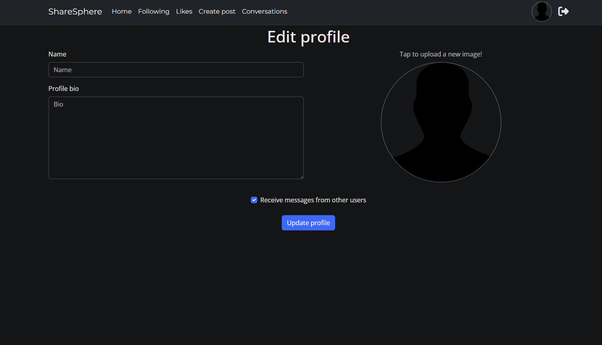</p>
    <p>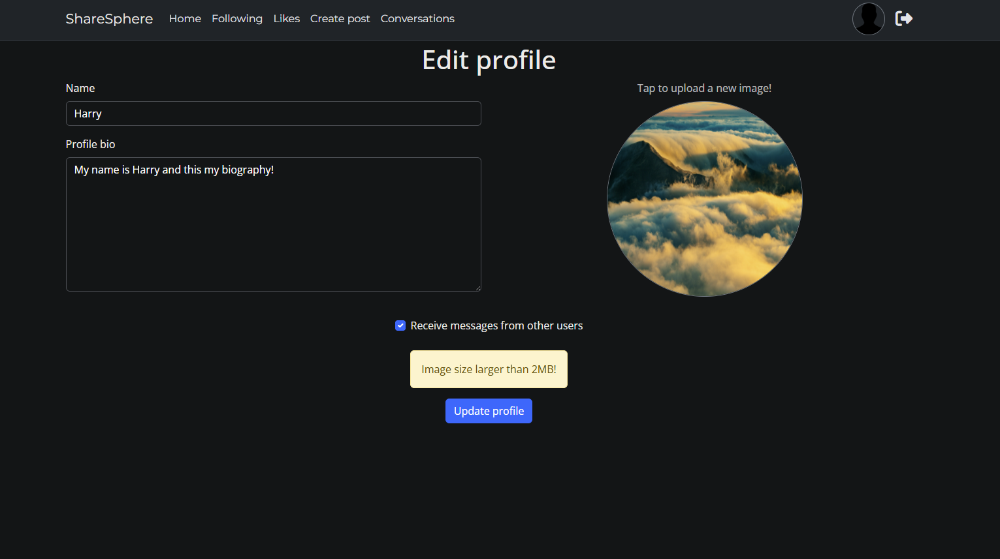</p>
    <p></p>
    </details>

- **Custom 404 page**

  - Entering an invalid URL that rendersa  404 page will display a custom, site integrated page.

    - Features a go back button that takes the user back to the previous URL.

    <details>
    <summary>
        404 page images
    </summary>
    <p></p>
    </details>

### Future Features

The very limited time frame that this project had to abide by obviously leaves room for lots of potential improvements and additional features.

- In regard to protecting the original intents and messages of a conversation a potential future feature would be to allow editing of conversations and their replies.

  - But to ensure that the integrity is protected every time an edit is made the previous versions get stored in a history that can be accessed when viewing the reply or conversation.

- An optimization that should be considered for implementation would be Google's guide for [properly sizing images](https://developer.chrome.com/docs/lighthouse/performance/uses-responsive-images/?utm_source=lighthouse&utm_medium=devtools) to ensure that page loading is efficient and doesn't use more bytes than necessary for loading images that are resized.

- Add the option to recover/change password.

- Look at the aesthetic improvement of incorporating more icons in the navbar.

  - I did not feel that just adding matching icons is the best way to go about it.

    - More time should be spent on considering whether or not they actually fit, their size, and the responsiveness.

- Add expanded post, follower, and following information for profile pages.

  - Clicking on the follower count could open a list of all the users that follow the user.

  - Clicking on the following count could open a list of all the users followed by the user.

  - Clicking on the posts count could open a feed of all the posts made by the user.

- Add a search bar for searching posts in the feeds.

  - The functionality for this is already implemented on the backend so this would only concern an input field and some state updates on the frontend.

- Spend more time on getting familiar with with Vitest and utlizing vitest mocking to forego the msw mocking and the no-so-functional handlers.js.

  - Some vi.mock has been used in the NavBar.test.jsx file but the time is too low to get more familiar with all of its potential. Feels very potent so far compared to Jest..

### CRUD Features

The principles of CRUD are at the essence of this project's features and any future features. The database modal and these CRUD features are also mentioned in the [readme for the API](https://github.com/Felteng/sharesphere-api/tree/main?tab=readme-ov-file#database-design).

**Create:**
An authenticated user can create posts, like posts, follow other users, create post comments, and send direct messages to other users that have receive messages enabled.

**Read:**
A user can browse and read any posts made on the website and see their respective amount of comments and likes, posts can also be sorted by ones the user has liked or from users they follow. Comments made under any post can be read by any user. If the user is engaged in any conversation with another user the contents of that conversation may also be read at any time. The amount of followers and or the amount of users a user follows can be seen from each individual users profile page.

**Update:**
An authenticated user can edit and update their profile as well as their individual contributions to the site, bar conversations and their replies.

- The reason a conversation or reply cannot be edited is to avoid any malicious altering of a private conversation between 2 individuals to make it seem as though a user had different intents in relation previous messages. They may still be deleted to ensure controlled privacy.

  - This could be worked around as a future feature where any updates made would save history of the previous versions of an object.

**Delete:**
An authenticated user can delete any of their contributions made to the site. Unfollowing, unliking, removing a post and all its comments, removing an individual comment, removing a conversation and all its replies, removing an individual reply..

## Technologies Used

### Environments

- [Balsamiq](https://www.balsamiq.com/) (Wireframes)
- [GitHub](https://github.com/) (Version control / Agile board)
- [GitPod](https://gitpod.io/) (IDE)
- [Heroku](https://heroku.com/) (Site hosting)

### JavaScript Libraries and Packages

- [React](https://react.dev/) (Library for web and native user interfaces - This is what the whole app is built on)
- [Create React App](https://react.dev/) (Creates a react application with just 1 command with no confusing configurations)
- [Axios](https://axios-http.com/) (Promise based HTTP client for the browser and node.js - Used for making API requests)
- [serve](https://www.npmjs.com/package/serve) (Static file serving and directory listing)
- [jwt-decode](https://github.com/auth0/jwt-decode) (JWT token decoding - Used to handle authentication tokens from API)
- [ESlint](https://eslint.org/) (Linting utility for JavaScript - Used to lint JS, JSX, and React)
- [Prettier](https://prettier.io/) (Opinionated code formatter used for this project)

### React Packages and Components

- [React Bootstrap](https://react-bootstrap.github.io/) (Bootstrap css framework rebuilt for React)
- [React Router](https://github.com/remix-run/react-router) (Declarative routing for React - Used to handle routing and internal links)
- [react-infinite-scroll-component](https://pypi.org/project/daphne/) (A component to add infinite scroll functionality - Used for feeds, comments, conversations, and replies)

### ESlint Configs

- [eslint-config-prettier](https://github.com/prettier/eslint-config-prettier) (Turns off rules that might conflict with Prettier for ESLint)
- [eslint-plugin-prettier](https://github.com/prettier/eslint-config-prettier) (Runs prettier as an ESlint rule)
- [eslint-plugin-react](https://github.com/jsx-eslint/eslint-plugin-react) (React-specific linting rules for ESLint)
- [eslint-plugin-react-hooks](https://github.com/facebook/react/tree/main/packages/eslint-plugin-react-hooks) (ESLint rules for React Hooks)

### Other Libraries and Packages

- [Bootstrap](https://getbootstrap.com/) (CSS Framework for responsive mobile-first websites)

## Testing

### Test Guide

Refer to [TESTING.md](TESTING.md) for the manual and automatic tests that have been carried out.

### Validator Testing

#### JavaScript [ESlint](https://eslint.org/)

- ESlint has been used to validate all the custom written code in the src directory.

  - This includes JavaScript, JSX, and React code.

  - running `npx eslint "src/**/*.{js,jsx,ts,tsx}"` in the terminal does not generate any errors or warnings.

#### Accessibility [WAVE Evaluation Tool](https://chromewebstore.google.com/detail/wave-evaluation-tool/jbbplnpkjmmeebjpijfedlgcdilocofh)

- WAVE has been used to evaluate contrast levels on all pages to ensure that the contrast complies with the WCAG standards.

- WAVE has also been used to evaluate and ensure that alt attributes are present on all images and that they descriptions are not redundant.

- I've left the alert for redundant links unattended.

  - This alert is triggered whenever there are multiple links on a page leading to the same page. This will obviously happen instances like post feeds and comment feeds where the owners avatar and username leads to their profile, just to name a few.

- I've also left a Noscript element alert unattended.

  - The element in question is the noscript element in the index.html file that is used to tell users that have JavaScript disabled that they won't be able to use the website.
    ```html
    <noscript> You need to enable JavaScript to run this app. </noscript>
    ```

#### Performance, Accessibility, Best Practices, SEO (Lighthouse Chrome DevTools)

- Lighthouse was used alongside WAVE to validate accessibility among the 3 other topics it covers.

- It was performed on all pages but I'll spare the need to look at results for the more plain pages such as 404 and the authentication pages (All of which do score 100 on best practices and accessibility).

  - These tests were performed on an incognito page to emulate a clean, and optimized environment.

  - Since the project uses JWT cookies for authentication, third party cookies will therefore be used on the client, which is considered a bad practice by devtools because of Google's plans to end support for third party cookies in the future.

    - The limited time frame for this project has meant that I have not had the time to evaluate other options to avoid third party cookies.

    - So summarize, the JWT cookies will cause the best practices score to drop from 100 to 78 in the lighthouse reports.

      <details>
      <summary>
          Difference when not using cookies and using cookies for the same page
      </summary>
      <p>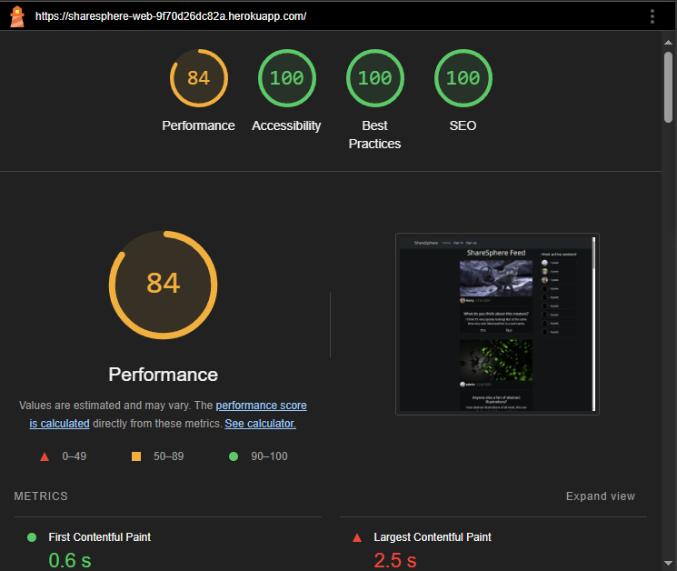</p>
      <p>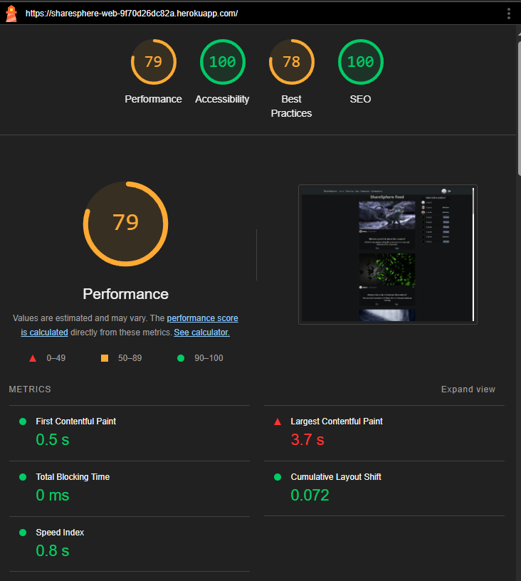</p>
      </details>

  - Below are the results for the major pages of the site when signed in:
    <details>
    <summary>
        Lighthouse desktop
    </summary>
    <p></p>
    <p>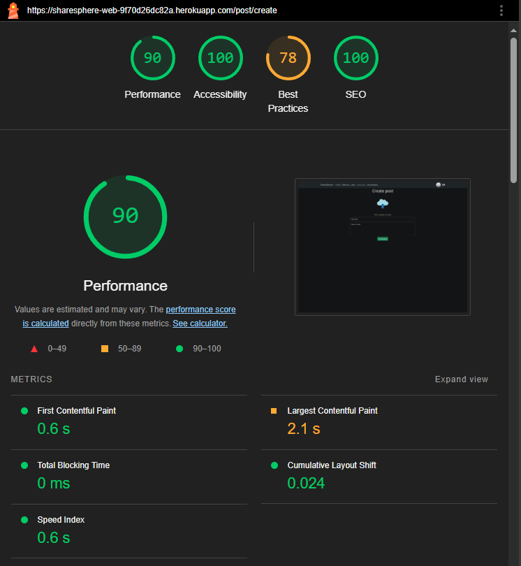</p>
    <p>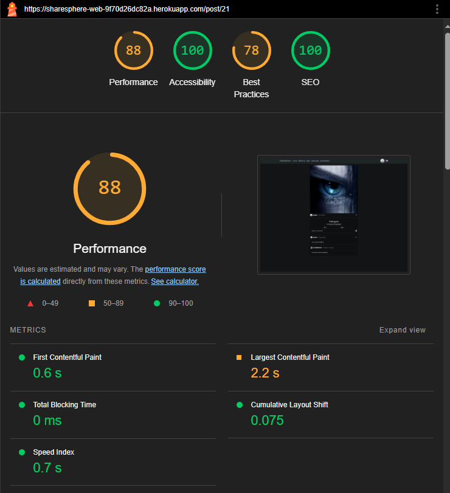</p>
    <p>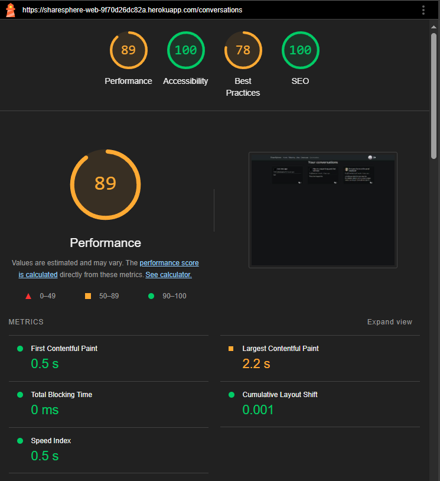</p>
    <p>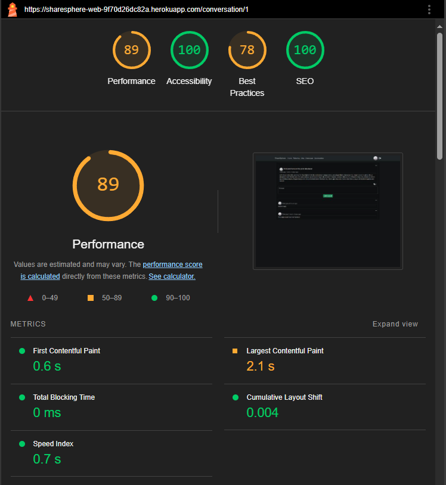</p>
    <p>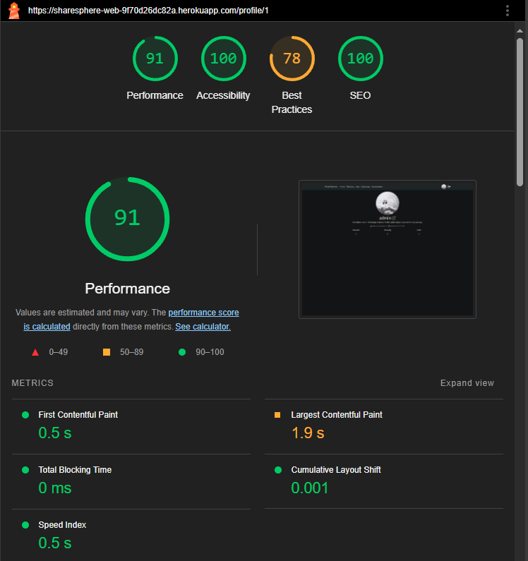</p>
    </details>

    <details>
    <summary>
        Lighthouse mobile
    </summary>
    <p>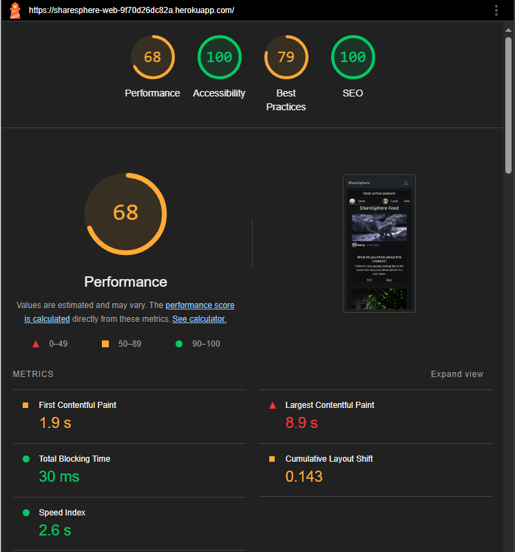</p>
    <p>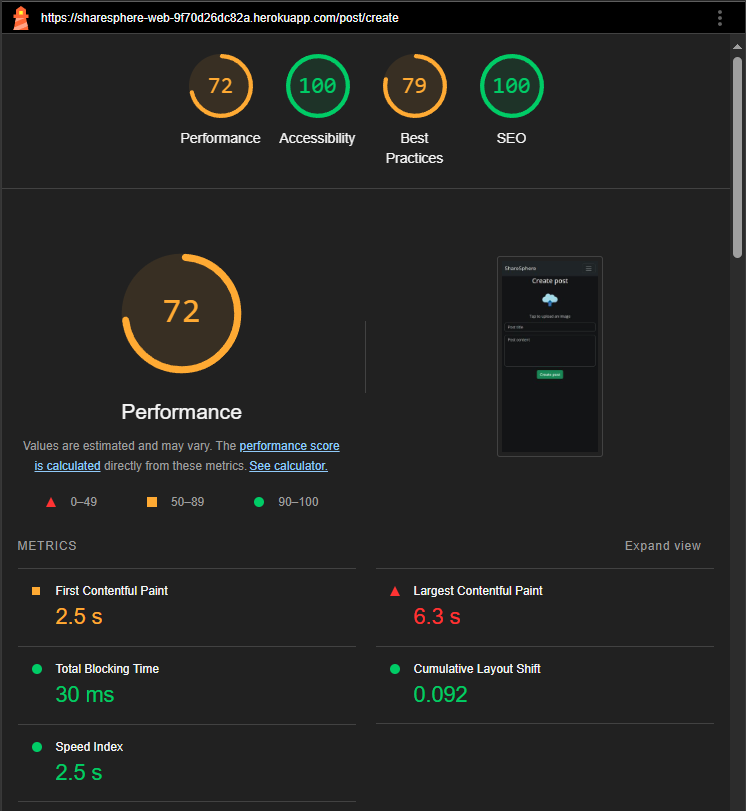</p>
    <p>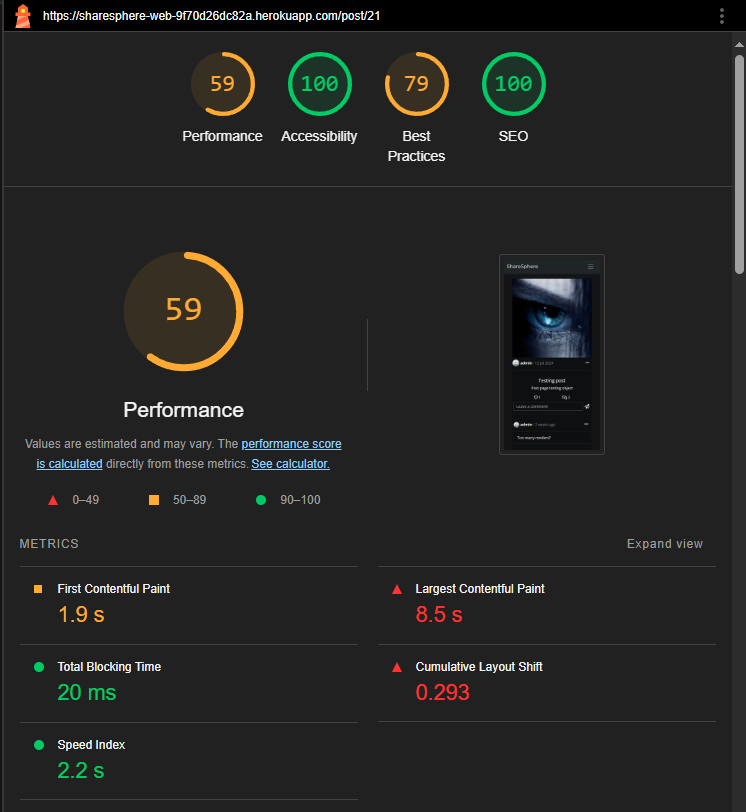</p>
    <p>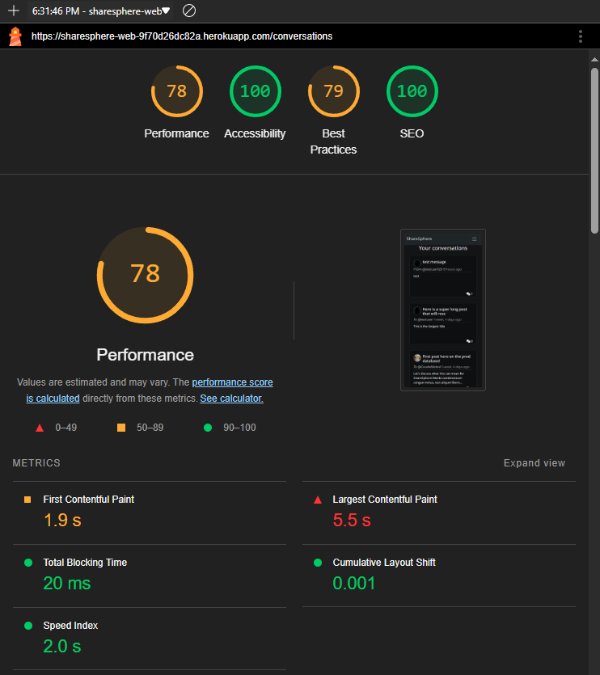</p>
    <p>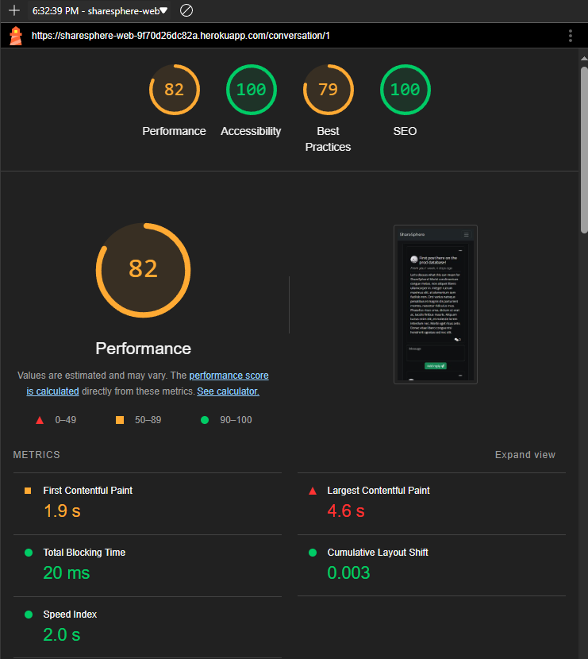</p>
    <p>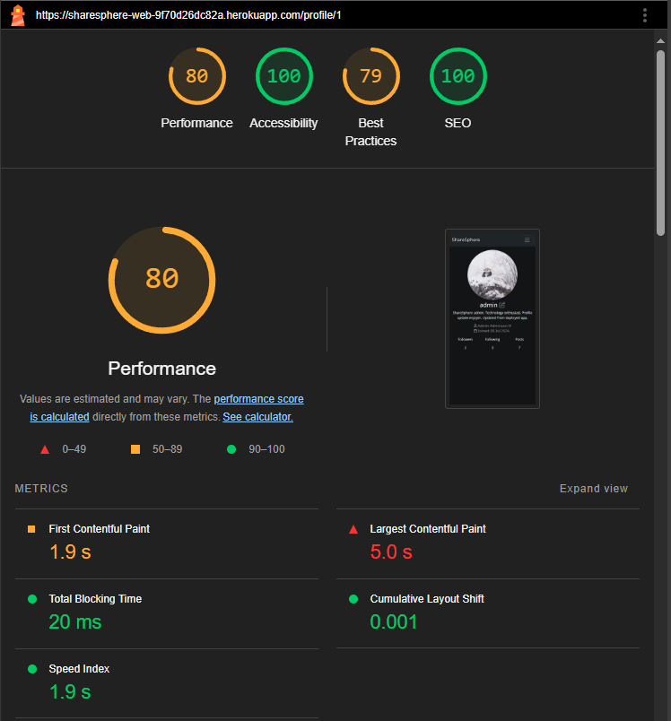</p>
    </details>

### Browser Testing

**Layout:**

- Layout tests have been performed with use of Chrome DevTools across all different breakpoints and various resolutions between each breakpoint.

  - Every page has been reviewed across the different layouts to ensure no overflow occurs and that the site feels intuitive and responsive to use.

**Functionality:**

- Testing complete functionality of the site. This includes:

  - Navigation.

  - Sign up.

  - Sign in.

  - Sign out.

  - Reading all available site content.

  - Creating comments, posts, conversations, and replies.

  - Deleting comments, posts, conversations, and replies.

  - Editing comments, posts, and user profile.

  - Following and unfollowing users.

  - Liking posts and unliking posts.

  - Redirections when a login session expires or for unauthenticated users.

- Functionality and layout has been tested across the 4 different browsers, Chrome, Firefox, MS Edge, and Safari with no alarming issues spotted.

  - Safari is the least tested browser.

### Addressed bugs

- Refreshing the page gives a brief flash of a view as though the user isn't authenticated.

  - This leads to more than just an odd visual. It can also generate faulty API requests where the logged in users id is used, but before the AuthContext useEffect hook has set the loggedInUser state the loggedInUser.pk will = undefined.

    - So instead of making a get request to "/posts/?likes**owner**profile=1" we end up making a get request to "/posts/?likes**owner**profile=undefined" until the loggedInUser state has been set.

  - The solution to this is to store the user data in a loggedInUser local storage object and use that object as the defualt value for the loggedInUser state:
    ```js
    const [loggedInUser, setLoggedInUser] = useState(() => {
      const savedLogin = localStorage.getItem("loggedInUser");
      return savedLogin ? JSON.parse(savedUser) : null;
    });
    ```
  - The logic used for managing the loggedInUser object:

    ```js
    useEffect(() => {
      const verifyLogin = async () => {
        const data = await checkLoginStatus();
        const savedLogin = localStorage.getItem("loggedInUser");

        if (!savedLogin && data) {
          setLoggedInUser(data);
          localStorage.setItem("loggedInUser", JSON.stringify(data));
        } else if (savedLogin && !data) {
          setLoggedInUser(null);
          localStorage.removeItem("loggedInUser");
        } else if (savedLogin && data && savedLogin !== data) {
          setLoggedInUser(data);
          localStorage.setItem("loggedInUser", JSON.stringify(data));
        }
      };
      verifyLogin();
    }, []);
    ```

  - A request will still be made on mount to ensure that the user should still have access and if they don't then the localStorage object is managed accordingly.

- Repeatedly clicking the like button on a post leads to faulty duplicate requests and error spam in console.

  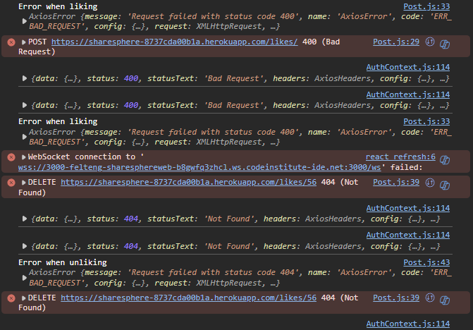

  - This is because clicking the button will keep triggering the function that handles the API request even if a request is alreadt being made.

  - The solution to the problem is simply to disable the functions from trying API requests if one is in progress.

    - This was done by adding a new useState hook and and using its condition for the like and unlike functions:

    ```js
      * const [loading, setLoading] = useState(false); *

      const handleLike = async () => {
        * if (loading) return; *
        * setLoading(true); *
        try {
          const { data } = await axiosRes.post("/likes/", { post: id });
          setLikeCount(likeCount + 1);
          setLike(data.id);
        } catch (error) {
          console.log("Error when liking", error);
        } finally {
          * setLoading(false); *
        }
      };

      const handleUnlike = async () => {
        * if (loading) return; *
        * setLoading(true); *
        try {
          await axiosRes.delete(`likes/${like}`);
          setLikeCount(likeCount - 1);
          setLike(null);
        } catch (error) {
          console.log("Error when unliking", error);
        } finally {
          * setLoading(false); *
        }
      };
    ```

### Unaddressed bugs

- Whenever a comment, a post, or a reply that is part of a page that has a next value is deleted the amount of objects deleted will be missed when fetching the next page.

  - For example a post with 17 comments would have 2 comments on the next page for infinite scroll to fetch when needed, but if I delete 2 of my comments from the first page of 15 comments those 2 comments on the next page will have moved to the first page on the backend, but when infiniteScroll tries to fetch the next page they will not be there and will therefore not be rendered.

    - I haven't landed on a specific solution for it that would keep the neat responsive flow of react rendering.

      - A possible fix would be to fetch the first object on the next page before performing the deletion.

- Similar to the bug above when adding a comment or reply, the older objects on the current page will get pushed to the next page, and when the next page is fetched they will be added again as duplicates.

## Deployment

### Local Deployment

- Deploying locally is quick and easy as the packages will run and function without any additional effort.

  1. Assuming a React app is created; Open a terminal in the workspace.

  2. To start the local server for development enter the following in the terminal:

     - ```npm start```

  3. The site should automatically open.
      - If it doesn't open on its own, you can CTRL click the "Local:" localhost address.

### Live Deployment

#### Prerequisites

- Ensure all of your packages and dependencies are present in your package.json file.

- Make sure you have serve installed and in your package.json. Or optionally use another web server.

  - If you do not have it installed you can type ```npm install serve``` in a terminal.

- Make sure to create a file called Procfile with NO extension, and inside the Procfile you want: ```web: serve -s build```.

  - This is very important to have because otherwise Heroku will not have a server to run the app on.


#### Instructions

Sign in or create an account at [Heroku](https://heroku.com) and once that's done proceed with the following steps:

1. At the start page/dashboard click 'New' in the top right part of the page to open a small dropdown.

2. In the dropdown select 'Create new app'.

3. Give the application a unique name and choose a region for deployment. I went with Europe since that's the closest for this applications purposes.

4. Click 'Create app'.

    - No config vars are needed for this application.

Now to prepare the project itself for deployment on Heroku we need to make sure Heroku knows what dependencies to install to run the project.

5. Ensure all of your packages and dependencies are present in your package.json file.

6. Make sure you have a Procfile with: ```web: serve -s build``` inside it.

    - If you want to use a different webserver than serve then your Procfile content should be different.

Make sure these files are to your repository before deploying.

7. Back on the app page on Heroku select 'Deploy', choose GitHub as deployment method and connect your account.

8. Search up the name of the repository for the app to select it.

9. Deploy manually by choosing a branch to deploy from and click 'Deploy Branch'.

    - I enabled automatic deploys for whenever a push is made to 'main' branch. This is however optional.

## Development

The following options are available to work with this code or run it in a local environment.

### Clone.

Pushed changes made to a local cloned repository will affect the original repository.

- On to the main page of the repository.

- Click on Code to toggle a dropdown menu above the list of files.

- Choose your desired method to copy the URL for the repository.

- In your work environment, open Git Bash and change current directory to target location for cloned repository.

- Type git clone followed by the copied URL and press enter.

### Fork

Any changes made to a forked repository will not affect the original repository.

- On the main repository page locate the fork button found in top right corner of the repository.

- Click the Fork button.

- Select a different owner if needed.

- Click Create Fork.

- The forked repository can now be found in the chosen owner account.

### Download as ZIP.

- On to the main page of the repository.

- Click on Code to toggle a dropdown menu above the list of files.

- Click on Download ZIP to start the download.

- Once downloaded, extract ZIP and use it in your local development environment.

## Credits

### Technical

- [Code Institute](https://codeinstitute.net/) for introduction and walkthrough of React and its potential.

- Adam Lapinski from Code Institute for his [Moment React app walkthrough](https://github.com/mr-fibonacci/moments) which was referred to on various occasions in this React application.

Refer to [Technologies Used](#technologies-used) for packages and libraries used.

### Media

- Image upload icon vector from [Freepik](https://www.freepik.com/free-vector/illustration-uploading-icon_2609994.htm#fromView=search&page=1&position=2&uuid=9be541e0-fa06-4684-9405-d17041835be8)

- Default post icon created by [Freepik - Flaticon](https://www.flaticon.com/free-icons/picture)

#### Icons

- All icons featured are from [Font Awesome](https://fontawesome.com)

#### Fonts

- All fonts from [Google Fonts](https://fonts.google.com)

#### Favicon

- Site favicon generated with [logoai](https://www.logoai.com/icon-generator).

### Honorable Mentions

- My mentor Rohit Sharma for his input and experience.

- The CodeInstitute slack community and all its members for their collaborative spirits and experiences.