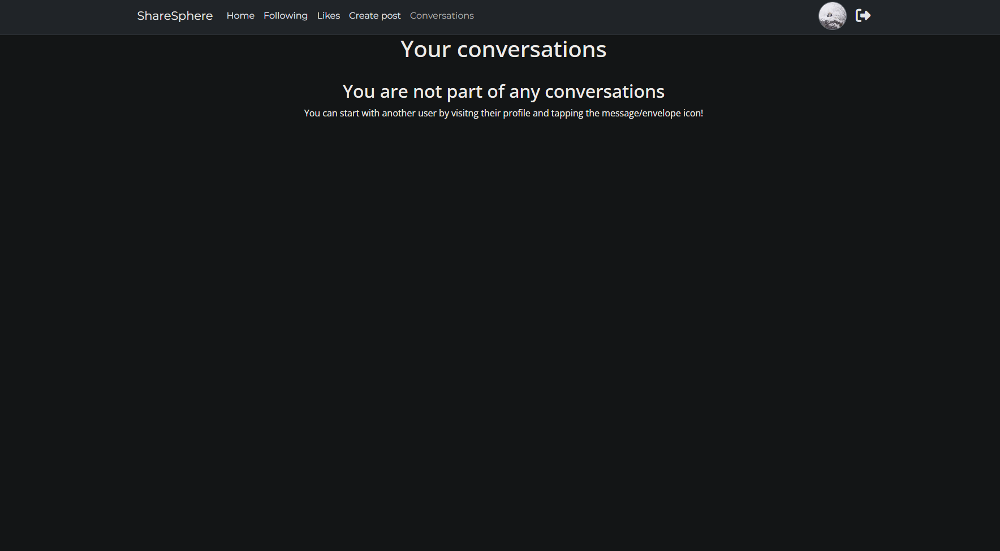
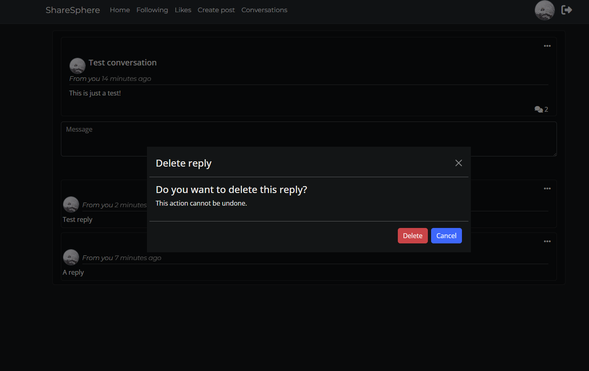

# ShareSphere Testing

Below is a summary of all the manual test cases that have been carried out for ShareSphere on the frontend, naturally these cover validation, handling, restrictions, etc. from the backend too, hence both repos share this testing file.

| Feature                           | Action                                               | Expected Output                                                                                                                   | Actual Output                                                                                                                     |
| --------------------------------- | ---------------------------------------------------- | --------------------------------------------------------------------------------------------------------------------------------- | --------------------------------------------------------------------------------------------------------------------------------- |
| Header                            |                                                      |                                                                                                                                   |                                                                                                                                   |
| Navigation Bar (Logged In)        | Click on Home link                                   | User is redirected to the Home page                                                                                               | User is redirected to the Home page                                                                                               |
| Navigation Bar (Logged In)        | Click on Following link                              | User is redirected to the Following page                                                                                          | User is redirected to the Following page                                                                                          |
| Navigation Bar (Logged In)        | Click on Likes link                                  | User is redirected to the Likes page                                                                                              | User is redirected to the Likes page                                                                                              |
| Navigation Bar (Logged In)        | Click on Create Post link                            | User is redirected to the Create Post page                                                                                        | User is redirected to the Create Post page                                                                                        |
| Navigation Bar (Logged In)        | Click on Conversations link                          | User is redirected to the Conversations page                                                                                      | User is redirected to the Conversations page                                                                                      |
| Navigation Bar (Logged In)        | Click on Profile avatar                              | User is redirected to the Profile page                                                                                            | User is redirected to the Profile page                                                                                            |
| Navigation Bar (Logged In)        | Click on site logo                                   | User is redirected to the Home page                                                                                               | User is redirected to the Home page                                                                                               |
| Navigation Bar (Logged In)        | Click on sign out logo next to Profile avatar        | Sign out confirmation modal appears in the middle of the screen                                                                   | Sign out confirmation modal appears in the middle of the screen                                                                   |
| Navigation Bar (Logged Out)       | Click on Home link                                   | User is redirected to the Home page                                                                                               | User is redirected to the Home page                                                                                               |
| Navigation Bar (Logged Out)       | Click on Sign In link                                | User is redirected to the Sign In page                                                                                            | User is redirected to the Sign In page                                                                                            |
| Navigation Bar (Logged Out)       | Click on Sign Up link                                | User is redirected to the Sign Up page                                                                                            | User is redirected to the Sign Up page                                                                                            |
| Navigation Bar (Logged Out)       | Click on site logo                                   | User is redirected to the Home page                                                                                               | User is redirected to the Home page                                                                                               |
| Navigation Bar Current Page       | Visit the create post page, then visit the home page | Create post page nav link is highlighted in a darker shade, then when going back to home the home nav link is instead highlighted | Create post page nav link is highlighted in a darker shade, then when going back to home the home nav link is instead highlighted |
| Navbar Toggling (Smaller Devices) | Click on burger menu icon                            | Navbar expands to show the navigation links                                                                                       | Navbar expands to show the navigation links                                                                                       |
| Navbar Toggling (Smaller Devices) | Click on Home link (navbar expanded)                 | User is redirected to the Home page and navbar collapses                                                                          | User is redirected to the Home page and navbar collapses                                                                          |
| Navbar Toggling (Smaller Devices) | Click on Following link (navbar expanded)            | User is redirected to the Following page and navbar collapses                                                                     | User is redirected to the Following page and navbar collapses                                                                     |
| Navbar Toggling (Smaller Devices) | Click on Likes link (navbar expanded)                | User is redirected to the Likes page and navbar collapses                                                                         | User is redirected to the Likes page and navbar collapses                                                                         |
| Navbar Toggling (Smaller Devices) | Click on Create Post link (navbar expanded)          | User is redirected to the Create Post page and navbar collapses                                                                   | User is redirected to the Create Post page and navbar collapses                                                                   |
| Navbar Toggling (Smaller Devices) | Click on Conversations link (navbar expanded)        | User is redirected to the Conversations page and navbar collapses                                                                 | User is redirected to the Conversations page and navbar collapses                                                                 |
| Navbar Toggling (Smaller Devices) | Click on Profile link (navbar expanded)              | User is redirected to the Profile page and navbar collapses                                                                       | User is redirected to the Profile page and navbar collapses                                                                       |
| Navbar Toggling (Smaller Devices) | Click on Sign In link (navbar expanded)              | User is redirected to the Sign In page and navbar collapses                                                                       | User is redirected to the Sign In page and navbar collapses                                                                       |
| Navbar Toggling (Smaller Devices) | Click on Sign Up link (navbar expanded)              | User is redirected to the Sign Up page and navbar collapses                                                                       | User is redirected to the Sign Up page and navbar collapses                                                                       |
| Navbar Toggling (Smaller Devices) | Click on Sign Up link (navbar expanded)              | User is redirected to the Sign Up page and navbar collapses                                                                       | User is redirected to the Sign Up page and navbar collapses                                                                       |
| Navbar Toggling (Smaller Devices) | Click on Sign Out link                               | Sign out confirmation modal appears in the middle of the screen                                                                   | Sign out confirmation modal appears in the middle of the screen                                                                   |

  

  

      Navigation testing images
  

  
These images do not cover every test case above as the added time for that would be too immense for the scope and time frame. But they should provide a decent overview of some tests and their results.

  

  

  

  

| Feature                   | Action                                                                | Expected Output                                                                                                                    | Actual Output                                                                                                                      |
| ------------------------- | --------------------------------------------------------------------- | ---------------------------------------------------------------------------------------------------------------------------------- | ---------------------------------------------------------------------------------------------------------------------------------- |
| **Sign Up Page**              |                                                                       |                                                                                                                                    |                                                                                                                                    |
| Load Sign Up Page         | Navigate to /signup                                                   | Sign up page is displayed with fields for username, password, and confirm password, as well as a feature image                     | Sign up page is displayed with fields for username, password, and confirm password, as well as a feature image                     |
| Enter Username            | Input a valid username                                                | Username field reflects the entered username                                                                                       | Username field reflects the entered username                                                                                       |
| Enter Password            | Input a valid password                                                | Password field reflects the entered password                                                                                       | Password field reflects the entered password                                                                                       |
| Confirm Password          | Input the same password in the confirm password field                 | Confirm password field reflects the entered password                                                                               | Confirm password field reflects the entered password                                                                               |
| Password Validation       | Input a password similar to the username                              | User is shown an error message indicating that the password cannot be similar to the username                                      | User is shown an error message indicating that the password cannot be similar to the username                                      |
| Mismatched Passwords      | Input different passwords in the password and confirm password fields | User is shown an error message indicating that the passwords do not match                                                          | User is shown an error message indicating that the passwords do not match                                                          |
| Successful Sign Up        | Input valid and matching username and password                        | User account is created, user is automatically signed in, and redirected to the home page                                          | User account is created, user is automatically signed in, and redirected to the home page                                          |
| Validation Error Handling | Leave required fields blank and attempt to sign up                    | User is shown an error message indicating which fields need to be filled in                                                        | User is shown an error message indicating which fields need to be filled in                                                        |
| Sign In Redirect          | Click on the sign in link                                             | User is redirected to the sign in page                                                                                             | User is redirected to the sign in page                                                                                             |
| Mobile View               | Load sign up page on a mobile device                                  | Sign up page is displayed properly with no feature image                                                                           | Sign up page is displayed properly with no feature image                                                                           |
| **Sign In Page**              |                                                                       |                                                                                                                                    |                                                                                                                                    |
| Load Sign In Page         | Navigate to /signin                                                   | Sign in page is displayed with fields for username and password, as well as a feature image                                        | Sign in page is displayed with fields for username and password, as well as a feature image                                        |
| Enter Username            | Input a valid username                                                | Username field reflects the entered username                                                                                       | Username field reflects the entered username                                                                                       |
| Enter Password            | Input a valid password                                                | Password field reflects the entered password                                                                                       | Password field reflects the entered password                                                                                       |
| Successful Sign In        | Input valid username and password                                     | User is signed in and redirected to the home page                                                                                  | User is signed in and redirected to the home page                                                                                  |
| Incorrect Credentials     | Input an incorrect username or password                               | User is shown an error message indicating incorrect username or password                                                           | User is shown an error message indicating incorrect username or password                                                           |
| Validation Error Handling | Leave required fields blank and attempt to sign in                    | User is shown an error message indicating which fields need to be filled in                                                        | User is shown an error message indicating which fields need to be filled in                                                        |
| Sign Up Redirect          | Click on the sign up link                                             | User is redirected to the sign up page                                                                                             | User is redirected to the sign up page                                                                                             |
| Redirect After Sign In    | Sign in with valid credentials from a protected page                  | User is signed in and redirected back to the originally requested protected page                                                   | User is signed in and redirected back to the originally requested protected page                                                   |
| Mobile View               | Load sign in page on a mobile device                                  | Sign in page is displayed properly with no feature image                                                                           | Sign in page is displayed properly with no feature image                                                                           |
| **Sign Out**                  |                                                                       |                                                                                                                                    |                                                                                                                                    |
| Open Sign Out Modal       | Click the sign out link/icon on navbar                                | A sign out confirmation modal is opened in the middle of the screen                                                                | A sign out confirmation modal is opened in the middle of the screen                                                                |
| Modal Content             | Verify content of the modal                                           | Modal asks user if they want to sign out, there's a red sign out button, a dark cancel button, and a cross in the top right corner | Modal asks user if they want to sign out, there's a red sign out button, a dark cancel button, and a cross in the top right corner |
| Close Delete Modal        | Click the "Cancel" button, the cross, or outside of the modal         | Modal closes and everything looks the same as before                                                                               | Modal closes and everything looks the same as before                                                                               |
| Confirm Sign Out          | Click the "Sign out" button                                           | User is signed out, modal closes itself, user is redirected to the home page, and a successful sign out message is displayed       | User is signed out, modal closes itself, user is redirected to the home page, and a successful sign out message is displayed       |

  

  

      Auth pages testing images
  

    
These images do not cover every test case above as the added time for that would be too immense for the scope and time frame. But they should provide a decent overview of some tests and their results.

  

  

  

  

  

  

  

  

  

| Feature                      | Action                                                                | Expected Output                                                                                                                                         | Actual Output                                                                                                                                           |
| ---------------------------- | --------------------------------------------------------------------- | ------------------------------------------------------------------------------------------------------------------------------------------------------- | ------------------------------------------------------------------------------------------------------------------------------------------------------- |
| **Post Feed**                    |                                                                       |                                                                                                                                                         |                                                                                                                                                         |
| Initial Posts                | Load the Home page, Following page, or Likes page                     | Up to fifteen posts are rendered, each displaying image, title, content, post owner, post creation date, like count, and comment count                  | Up to fifteen posts are rendered, each displaying image, title, content, post owner, post creation date, like count, and comment count                  |
| Infinite Scroll              | Scroll to the bottom of the initial fifteen posts                     | Next fifteen posts are fetched and rendered below the initial posts                                                                                     | Next fifteen posts are fetched and rendered below the initial posts                                                                                     |
| Infinite Scroll              | Continue scrolling to the bottom after additional posts are loaded    | Additional posts are fetched and rendered until there are no more posts to view                                                                         | Additional posts are fetched and rendered until there are no more posts to view                                                                         |
| No More Posts                | Scroll to the bottom when all posts have been loaded                  | No additional posts are fetched, and a message or indicator shows that there are no more posts to view                                                  | No additional posts are fetched, and a message or indicator shows that there are no more posts to view                                                  |
| Post Content                 | Verify content of each post                                           | Each post displays the correct image, title, content, post owner, post creation date, like count, and comment count                                     | Each post displays the correct image, title, content, post owner, post creation date, like count, and comment count                                     |
| Post Links                   | Click the post image                                                  | User is redirected to the post's individual page                                                                                                        | User is redirected to the post's individual page                                                                                                        |
| Post Links                   | Click post owner avatar, name, or post date                           | User is redirected to the post owner's profile page                                                                                                     | User is redirected to the post owner's profile page                                                                                                     |
| Post Links                   | Click the comments icon at the bottom of the post                     | User is redirected to the post's individual page                                                                                                        | User is redirected to the post's individual page                                                                                                        |
| Edit Dropdown Menu           | Check edit dropdown visibility and content                            | As the owner of a post, three dots are visible to the far right of the post owner name. Clicking them opens a dropdown with "Edit" and "Delete" options | As the owner of a post, three dots are visible to the far right of the post owner name. Clicking them opens a dropdown with "Edit" and "Delete" options |
| Responsive Design            | Resize browser window                                                 | Width an coverage of feed adjusts appropriately for different screen sizes (e.g., mobile, tablet, desktop)                                              | Width an coverage of feed adjusts appropriately for different screen sizes (e.g., mobile, tablet, desktop)                                              |
| **Post Page**                    |                                                                       |                                                                                                                                                         |                                                                                                                                                         |
| Initial Load                 | Click the image of post in a post feed                                | The post is rendered with the addition of post comments and the comment form rendered underneath                                                        | The post is rendered with the addition of post comments and the comment form rendered underneath                                                        |
| Post Content                 | Verify the content of the loaded post page                            | The post content looks identical to that of the content in the post feed, with the addition of post comments and the comment form rendered underneath   |                                                                                                                                                         |
| Infinite Scroll              | Scroll to the bottom of the initial fifteen comments                  | Next fifteen comments are fetched and rendered below the initial comments                                                                               | Next fifteen comments are fetched and rendered below the initial comments                                                                               |
| Infinite Scroll              | Continue scrolling to the bottom after additional comments are loaded | Additional comments are fetched and rendered until there are no more comments to view                                                                   | Additional comments are fetched and rendered until there are no more comments to view                                                                   |
| Post Links                   | Click the post image and the comments icon                            | User is not redirected anywhere as they are not links on the post page                                                                                  | User is not redirected anywhere as they are not links on the post page                                                                                  |
| Post Links                   | Click post owner avatar, name, or post date                           | User is redirected to the post owner's profile page                                                                                                     | User is redirected to the post owner's profile page                                                                                                     |
| Edit Dropdown Menu           | Check edit dropdown visibility and content                            | As the owner of a post, three dots are visible to the far right of the post owner name. Clicking them opens a dropdown with "Edit" and "Delete" options | As the owner of a post, three dots are visible to the far right of the post owner name. Clicking them opens a dropdown with "Edit" and "Delete" options |
| **Post Creation Page**           |                                                                       |                                                                                                                                                         |                                                                                                                                                         |
| Initial Form                 | Load the Create Post page                                             | An empty form with an image input field, title field, and content field is rendered                                                                     | An empty form with an image input field, title field, and content field is rendered                                                                     |
| Form Validation              | Submit an empty form                                                  | Field error for the post title field is displayed saying the field cannot be blank                                                                      | Field error for the post title field is displayed saying the field cannot be blank                                                                      |
| Form Image Validation        | Submit the form with an image larger than 2mb file size               | Field error for the post image field is displayed saying "Image size larger than 2MB"                                                                   | Field error for the post image field is displayed saying "Image size larger than 2MB"                                                                   |
| Form Image Validation        | Submit the form with an image that is wider than 4096px               | Field error for the post image field is displayed saying "Image width is larger than 4096px"                                                            | Field error for the post image field is displayed saying "Image width is larger than 4096px"                                                            |
| Form Image Validation        | Submit the form with an image that is higher than 4096px              | Field error for the post image field is displayed saying "Image height is larger than 4096px"                                                           | Field error for the post image field is displayed saying "Image height is larger than 4096px"                                                           |
| Form Image Validation        | Submit the form with a file that is not an image in the image field   | Field error for the post image field is displayed saying "Upload a valid image"                                                                         | Field error for the post image field is displayed saying "Upload a valid image"                                                                         |
| Image Input                  | Select and image for the image input field                            | The image upload icon turns into an image preview of the chosen image instead                                                                           | The image upload icon turns into an image preview of the chosen image instead                                                                           |
| Submit Post                  | Submit a valid form                                                   | A post is created with the data provided in each respective field, user is redirected to the newly created post's page                                  | A post is created with the data provided in each respective field, user is redirected to the newly created post's page                                  |
| Submit Post                  | Submit a valid form without an image                                  | A post is created with the data provided and post image is a black default post image, user is redirected to the newly created post's page              | A post is created with the data provided and post image is a black default post image, user is redirected to the newly created post's page              |
| Responsive Design            | Resize browser window                                                 | Create post page adjusts layout appropriately for different screen sizes (e.g., mobile, tablet, desktop)                                                | Create post page adjusts layout appropriately for different screen sizes (e.g., mobile, tablet, desktop)                                                |
| **Post Liking**                  |                                                                       |                                                                                                                                                         |                                                                                                                                                         |
| Like Icon                    | Verify the like icon's visibility                                     | A hollow heart icon is visible on every post, even for post owners and logged out users                                                                 | A hollow heart icon is visible on every post, even for post owners and logged out users                                                                 |
| Lke Post                     | Click the like icon as a logged in user                               | The heart icon turns into a red, solid heart and the like count increases by 1                                                                          | The heart icon turns into a red, solid heart and the like count increases by 1                                                                          |
| Attempt Like                 | Click the like icon as the post owner                                 | A tooltip appears above the like icon letting he user know they can't like their own posts                                                              | A tooltip appears above the like icon letting he user know they can't like their own posts                                                              |
| Attempt Like                 | Click the like icon as a logged out user                              | A tooltip appears above the like icon letting he user know they have to log in to like a post                                                           | A tooltip appears above the like icon letting he user know they have to log in to like a post                                                           |
| Unlike Post                  | Click the solid like icon on a post you have liked                    | The heart icon turns back into a grey, hollow heart and the like count decreases by 1                                                                   | The heart icon turns back into a grey, hollow heart and the like count decreases by 1                                                                   |
| Spam Like                    | Spam click the like icon                                              | No unintended behavior happens as the button will only do something once the post or delete request has finished                                        | No unintended behavior happens as the button will only do something once the post or delete request has finished                                        |
| **Post CRUD**                    |                                                                       |                                                                                                                                                         |                                                                                                                                                         |
| Toggle Edit Post (On)        | Choose "Edit" from the dropdown menu                                  | The post gets transformed into a post form populated with the post content, the three dots turns into a cross to cancel editing                         | The post gets transformed into a post form populated with the post content, the three dots turns into a cross to cancel editing                         |
| Toggle Edit Post (Off)       | Click the cross in place of the three dots menu                       | The post gets transformed back to its original state with its original content                                                                          | The post gets transformed back to its original state with its original content                                                                          |
| Form Validation              | Remove the content and submit an empty form                           | Field error for the post title field is displayed saying the field cannot be blank                                                                      | Field error for the post title field is displayed saying the field cannot be blank                                                                      |
| Form Image Validation        | Submit the form with an image larger than 2mb file size               | Field error for the post image field is displayed saying "Image size larger than 2MB"                                                                   | Field error for the post image field is displayed saying "Image size larger than 2MB"                                                                   |
| Form Image Validation        | Submit the form with an image that is wider than 4096px               | Field error for the post image field is displayed saying "Image width is larger than 4096px"                                                            | Field error for the post image field is displayed saying "Image width is larger than 4096px"                                                            |
| Form Image Validation        | Submit the form with an image that is higher than 4096px              | Field error for the post image field is displayed saying "Image height is larger than 4096px"                                                           | Field error for the post image field is displayed saying "Image height is larger than 4096px"                                                           |
| Form Image Validation        | Submit the form with a file that is not an image in the image field   | Field error for the post image field is displayed saying "Upload a valid image"                                                                         | Field error for the post image field is displayed saying "Upload a valid image"                                                                         |
| Image Input                  | Select a new image for the image input field                          | The preview image changes from the posts current image to the selected image                                                                            | The preview image changes from the posts current image to the selected image                                                                            |
| Submit Edited Post           | Submit a valid, edited post form                                      | The edit request gets sent, the form is toggled off, and the changes made are instantly reflected in the post                                           | The edit request gets sent, the form is toggled off, and the changes made are instantly reflected in the post                                           |
| Open Delete Modal            | Choose "Delete" from the dropdown menu                                | A delete confirmation modal appears in the middle of the screen asking the user if they want to delete the post                                         | A delete confirmation modal appears in the middle of the screen asking the user if they want to delete the post                                         |
| Modal Content                | Verify the content of the modal                                       | Modal title and content mentions post deletion, there's a delete and a cancel button, and a cross in the top right corner                               | Modal title and content mentions post deletion, there's a delete and a cancel button, and a cross in the top right corner                               |
| Close Delete Modal           | Click the "Cancel" button, the cross, or outside of the modal         | Modal closes and everything looks the same as before                                                                                                    | Modal closes and everything looks the same as before                                                                                                    |
| Confirm Deletion (Feed)      | Click the "Delete" button when deleting a post from a feed            | Delete request is made, modal closes itself, and the post is removed from the rendered posts                                                            | Delete request is made, modal closes itself, and the post is removed from the rendered posts                                                            |
| Confirm Deletion (Post Page) | Click the "Delete" button when deleting a post from its page          | Delete request is made, modal closes itself, and the user is redirected to the home page                                                                | Delete request is made, modal closes itself, and the user is redirected to the home page                                                                |

  

  

      Post testing images
  

  
These images do not cover every test case above as the added time for that would be too immense for the scope and time frame. But they should provide a decent overview of some tests and their results.

  

  
 

  

  

  

  

  

  

  

  

  

| Feature                             | Action                                                                 | Expected Output                                                                                                                                                                                                                                     | Actual Output                                                                                                                                                                                                                                       |
| ----------------------------------- | ---------------------------------------------------------------------- | --------------------------------------------------------------------------------------------------------------------------------------------------------------------------------------------------------------------------------------------------- | --------------------------------------------------------------------------------------------------------------------------------------------------------------------------------------------------------------------------------------------------- |
| **Most Active Posters**                 |                                                                        |                                                                                                                                                                                                                                                     |                                                                                                                                                                                                                                                     |
| Initial Load                        | Load the Home , Following, or Likes page                               | A list of the ten users with the most posts is visible next to the post feed, labeled "Most active posters"                                                                                                                                         | A list of the ten users with the most posts is visible next to the post feed, labeled "Most active posters"                                                                                                                                         |
| User Data                           | Verify content of "Most active posters" list                           | Each user in the list displays correct information such as profile picture, username when picture is hovered, and post count                                                                                                                        | Each user in the list displays correct information such as profile picture, username when picture is hovered, and post count                                                                                                                        |
| Following Status                    | Verify following status next to users                                  | For users not followed by the logged in user a follow button is seen to the right of each user, for users followed by the logged in user an unfollow button is visible instead. The logged in user sees no button for their own profile in the list | For users not followed by the logged in user a follow button is seen to the right of each user, for users followed by the logged in user an unfollow button is visible instead. The logged in user sees no button for their own profile in the list |
| Following Status Updates            | Veriy that the button and status updates when clicking follow/unfollow | Clicking the follow button follows the user and turns the button into an unfollow button, and vice versa                                                                                                                                            | Clicking the follow button follows the user and turns the button into an unfollow button, and vice versa                                                                                                                                            |
| Spam Follow Requests                | Spam the follow/unfollow buttons                                       | No unintended behavior happens as the button will only do something once the post or delete request has finished                                                                                                                                    | No unintended behavior happens as the button will only do something once the post or delete request has finished                                                                                                                                    |
| Responsive Design (Smaller Devices) | Resize browser window to less than 992px                               | The list turns into a horizontally scrollable list as opposed to a vertical list on smaller resolutions                                                                                                                                             | The list turns into a horizontally scrollable list as opposed to a vertical list on smaller resolutions                                                                                                                                             |

  

  

      Most active posters testing images
  

  
These images do not cover every test case above as the added time for that would be too immense for the scope and time frame. But they should provide a decent overview of some tests and their results.

  

  

  

  

  

| Feature                   | Action                                                        | Expected Output                                                                                                                                                 | Actual Output                                                                                                                                                   |
| ------------------------- | ------------------------------------------------------------- | --------------------------------------------------------------------------------------------------------------------------------------------------------------- | --------------------------------------------------------------------------------------------------------------------------------------------------------------- |
| **Comments**                  |                                                               |                                                                                                                                                                 |                                                                                                                                                                 |
| Loading Comments          | Open a post page with comments                                | Up to 15 comments are rendered underneath the post, more rendered when scrolling to the bottom                                                                  | Up to 15 comments are rendered underneath the post, more rendered when scrolling to the bottom                                                                  |
| Comment Content           | Verify the content of each comment                            | Each comment displays the correct content, comment owner, and comment creation date. Edit dropdown is visible to the owner of a comment                         | Each comment displays the correct content, comment owner, and comment creation date. Edit dropdown is visible to the owner of a comment                         |
| Commed Update Time        | Hover the comment creation date                               | Shows a tooltip that tells the user when the comment was updated                                                                                                | Shows a tooltip that tells the user when the comment was updated                                                                                                |
| Comment Links             | Click comment owner avatar, name, or comment date             | User is redirected to the comment owner's profile page                                                                                                          | User is redirected to the comment owner's profile page                                                                                                          |
| Edit Dropdown Menu        | Check edit dropdown visibility and content                    | As the owner of a comment, three dots are visible to the far right of the comment owner's name. Clicking them opens a dropdown with "Edit" and "Delete" options | As the owner of a comment, three dots are visible to the far right of the comment owner's name. Clicking them opens a dropdown with "Edit" and "Delete" options |
| **Comment Creation**          |                                                               |                                                                                                                                                                 |                                                                                                                                                                 |
| Initial Form (Logged In)  | Open a post page to see comment form                          | An empty comment form is directly visible underneath the post                                                                                                   | An empty comment form is directly visible underneath the post                                                                                                   |
| Initial Form (Logged Out) | Open a post page to see comment form                          | A prompt asking the user to sign in is in place of the comment form                                                                                             | A prompt asking the user to sign in is in place of the comment form                                                                                             |
| Form Validation           | Submit an empty comment                                       | A tooltip is shown above the comment field asking the user to please write a comment first                                                                      | A tooltip is shown above the comment field asking the user to please write a comment first                                                                      |
| Submit Comment            | Submit a valid form                                           | The comment is created and added to the top of the rendered comments, the comment form gets emptied, and the comment count is increased by 1                    | The comment is created and added to the top of the rendered comments, the comment form gets emptied, and the comment count is increased by 1                    |
| Spam Submit Comment       | Spam submit the same comment while it's being posted          | No extra requests are made as they get disabled when the first post request gets made                                                                           | No extra requests are made as they get disabled when the first post request gets made                                                                           |
| **Comment CRUD**              |                                                               |                                                                                                                                                                 |                                                                                                                                                                 |
| Toggle Edit Comment (On)  | Choose "Edit" from the dropdown menu                          | The comment gets transformed into a comment form populated with the comment content, the three dots turns into a cross to cancel editing                        | The comment gets transformed into a comment form populated with the comment content, the three dots turns into a cross to cancel editing                        |
| Toggle Edit Comment (Off) | Click the cross in place of the three dots menu               | The comment gets transformed back to its original state with its original content                                                                               | The comment gets transformed back to its original state with its original content                                                                               |
| Form Validation           | Remove the content and submit an empty comment                | A tooltip is shown above the comment field asking the user to please write a comment first                                                                      | A tooltip is shown above the comment field asking the user to please write a comment first                                                                      |
| Submit Edited Comment     | Submit a valid, edited comment form                           | The edit request gets sent, the form is toggled off, and the changes made are instantly reflected in the comment                                                | The edit request gets sent, the form is toggled off, and the changes made are instantly reflected in the comment                                                |
| Spam Submit Comment       | Spam submit the same edited comment while it's being put      | No extra requests are made as they get disabled when the first put request gets made                                                                            | No extra requests are made as they get disabled when the first put request gets made                                                                            |
| Open Delete Modal         | Choose "Delete" from the dropdown menu                        | A delete confirmation modal appears in the middle of the screen asking the user if they want to delete the comment                                              | A delete confirmation modal appears in the middle of the screen asking the user if they want to delete the comment                                              |
| Modal Content             | Verify the content of the modal                               | Modal title and content mentions comment deletion, there's a delete and a cancel button, and a cross in the top right corner                                    | Modal title and content mentions comment deletion, there's a delete and a cancel button, and a cross in the top right corner                                    |
| Close Delete Modal        | Click the "Cancel" button, the cross, or outside of the modal | Modal closes and everything looks the same as before                                                                                                            | Modal closes and everything looks the same as before                                                                                                            |
| Confirm Deletion          | Click the "Delete" button                                     | Delete request is made, modal closes itself, the comment is removed from the rendered comments, and the comment count is decreased by 1                         | Delete request is made, modal closes itself, the comment is removed from the rendered comments, and the comment count is decreased by 1                         |

  

  

      Comment testing images
  

  
These images do not cover every test case above as the added time for that would be too immense for the scope and time frame. But they should provide a decent overview of some tests and their results.

  

  

  

  

  

  

  

  

  

  

| Feature                  | Action                                                                            | Expected Output                                                                                                                                                                                                                | Actual Output                                                                                                                                                                                                                  |
| ------------------------ | --------------------------------------------------------------------------------- | ------------------------------------------------------------------------------------------------------------------------------------------------------------------------------------------------------------------------------ | ------------------------------------------------------------------------------------------------------------------------------------------------------------------------------------------------------------------------------ |
| **Profile Page**             |                                                                                   |                                                                                                                                                                                                                                |                                                                                                                                                                                                                                |
| Load a Profile           | Visit any user's profile page                                                     | Avatar, username, bio (if provided), name (if provided), join date, followers count, following count, and posts count are visible                                                                                              | Avatar, username, bio (if provided), name (if provided), join date, followers count, following count, and posts count are visible                                                                                              |
| Message Icon             | Visit another user's profile while logged in                                      | A message icon is visible next to the username of the profile that is being visited                                                                                                                                            | A message icon is visible next to the username of the profile that is being visited                                                                                                                                            |
| Message Icon             | Visit another user's (with receive messages set to false) profile while logged in | No message or edit profile icons are visible                                                                                                                                                                                   | No message or edit profile icons are visible                                                                                                                                                                                   |
| Edit Profile Icon        | Visit own profile while logged in                                                 | An edit profile icon is visible in place of the message icon                                                                                                                                                                   | An edit profile icon is visible in place of the message icon                                                                                                                                                                   |
| No Icons (Logged Out)    | Visit any profile page while logged out                                           | No message or edit profile icons are visible                                                                                                                                                                                   | No message or edit profile icons are visible                                                                                                                                                                                   |
| Profile Content          | Verify content on the profile page                                                | The profile page displays correct avatar, username, bio (if provided), name (if provided), join date, followers count, following count, and posts count                                                                        | The profile page displays correct avatar, username, bio (if provided), name (if provided), join date, followers count, following count, and posts count                                                                        |
| Following Count          | Verify following count                                                            | Following count accurately reflects the number users the user follows                                                                                                                                                          | Following count accurately reflects the number users the user follows                                                                                                                                                          |
| Followers Count          | Verify followers count                                                            | Followers count accurately reflects the number of followers the user has                                                                                                                                                       | Followers count accurately reflects the number of followers the user has                                                                                                                                                       |
| Posts Count              | Verify posts count                                                                | Posts count accurately reflects the number of posts made by the user                                                                                                                                                           | Posts count accurately reflects the number of posts made by the user                                                                                                                                                           |
| Edit Profile Action      | Click on edit profile icon                                                        | User is redirected to the edit profile page                                                                                                                                                                                    | User is redirected to the edit profile page                                                                                                                                                                                    |
| Send Message Action      | Click on message icon                                                             | Modal to start a private conversation with the profile owner appears in the middle of the screen                                                                                                                               | Modal to start a private conversation with the profile owner appears in the middle of the screen                                                                                                                               |
| Following Status         | Verify following status                                                           | If user is not followed by the logged in user a follow button is seen under the name, if user is followed by the logged in user an unfollow button is visible instead. The logged in user sees no button for their own profile | If user is not followed by the logged in user a follow button is seen under the name, if user is followed by the logged in user an unfollow button is visible instead. The logged in user sees no button for their own profile |
| Following Status Updates | Veriy that the button and status updates when clicking follow/unfollow            | Clicking the follow button follows the user and turns the button into an unfollow button, and vice versa                                                                                                                       | Clicking the follow button follows the user and turns the button into an unfollow button, and vice versa                                                                                                                       |
| Spam Follow Requests     | Spam the follow/unfollow buttons                                                  | No unintended behavior happens as the button will only do something once the post or delete request has finished                                                                                                               | No unintended behavior happens as the button will only do something once the post or delete request has finished                                                                                                               |
| Responsive Design        | Resize browser window                                                             | Profile page adjusts layout appropriately for different screen sizes (e.g., mobile, tablet, desktop)                                                                                                                           | Profile page adjusts layout appropriately for different screen sizes (e.g., mobile, tablet, desktop)                                                                                                                           |
| **Profile Editing Page**     |                                                                                   |                                                                                                                                                                                                                                |                                                                                                                                                                                                                                |
| Load Edit Profile Page   | Click on the edit profile icon                                                    | User is redirected to the edit profile page                                                                                                                                                                                    | User is redirected to the edit profile page                                                                                                                                                                                    |
| Display Current Info     | Verify current profile information                                                | Current avatar, bio, name, and a checkbox for receive messages are prepopulated with existing information                                                                                                                      | Current avatar, bio, name, and a checkbox for receive messages are prepopulated with existing information                                                                                                                      |
| Change Avatar            | Upload a new avatar image                                                         | The new avatar image is displayed as a preview                                                                                                                                                                                 | The new avatar image is displayed as a preview                                                                                                                                                                                 |
| Update Bio               | Change the bio field                                                              | Bio field reflects the new input                                                                                                                                                                                               | Bio field reflects the new input                                                                                                                                                                                               |
| Update Name              | Change the name field                                                             | Name field reflects the new input                                                                                                                                                                                              | Name field reflects the new input                                                                                                                                                                                              |
| Receive Messages         | Change the state of the receive messages checkbox (True by default)               | Receive messages field reflects the state of the checkbox                                                                                                                                                                      | Receive messages field reflects the state of the checkbox                                                                                                                                                                      |
| Form Image Validation    | Submit the form with an image larger than 2mb file size                           | Field error for the post image field is displayed saying "Image size larger than 2MB"                                                                                                                                          | Field error for the post image field is displayed saying "Image size larger than 2MB"                                                                                                                                          |
| Form Image Validation    | Submit the form with an image that is wider than 4096px                           | Field error for the post image field is displayed saying "Image width is larger than 4096px"                                                                                                                                   | Field error for the post image field is displayed saying "Image width is larger than 4096px"                                                                                                                                   |
| Form Image Validation    | Submit the form with an image that is higher than 4096px                          | Field error for the post image field is displayed saying "Image height is larger than 4096px"                                                                                                                                  | Field error for the post image field is displayed saying "Image height is larger than 4096px"                                                                                                                                  |
| Form Image Validation    | Submit the form with a file that is not an image in the image field               | Field error for the post image field is displayed saying "Upload a valid image"                                                                                                                                                | Field error for the post image field is displayed saying "Upload a valid image"                                                                                                                                                |
| Save Changes             | Click the update profile button                                                   | Changes are saved, and user is redirected to the profile page with updated information, avatar on the navbar is updated too                                                                                                    | Changes are saved, and user is redirected to the profile page with updated information, avatar on the navbar is updated too                                                                                                    |
| Responsive Design        | Resize browser window                                                             | Edit profile page adjusts layout appropriately for different screen sizes (e.g., mobile, tablet, desktop)                                                                                                                      | Edit profile page adjusts layout appropriately for different screen sizes                                                                                                                                                      |

    Profile testing images

These images do not cover every test case above as the added time for that would be too immense for the scope and time frame. But they should provide a decent overview of some tests and their results.

| Feature                  | Action                                                                     | Expected Output                                                                                                                                                                                                                                                       | Actual Output                                                                                                                                                                                                                                                         |
| ------------------------ | -------------------------------------------------------------------------- | --------------------------------------------------------------------------------------------------------------------------------------------------------------------------------------------------------------------------------------------------------------------- | --------------------------------------------------------------------------------------------------------------------------------------------------------------------------------------------------------------------------------------------------------------------- |
| **Conversations Page**       |                                                                            |                                                                                                                                                                                                                                                                       |                                                                                                                                                                                                                                                                       |
| Load Conversations       | Load the conversations page                                                | Up to fifteen conversations are rendered, each displaying topic, message, the other user in the conversation, if the conversation was sent to or received from the other user, conversation creation date, and replies count                                          | Up to fifteen conversations are rendered, each displaying topic, message, the other user in the conversation, if the conversation was sent to or received from the other user, conversation creation date, and replies count                                          |
| Load Conversations       | Load the conversations page for a user with no conversations               | A message is rendered letting the user know they are not part of any conversations and how to start one                                                                                                                                                               | A message is rendered letting the user know they are not part of any conversations and how to start one                                                                                                                                                               |
| Conversation Content     | Verify content of each conversation                                        | Each conversation displays the correct topic, message, the other user in the conversation, conversation creation date, and replies count                                                                                                                              | Each conversation displays the correct topic, message, the other user in the conversation, conversation creation date, and replies count                                                                                                                              |
| Conversation Content     | Verify the dynamics the avatar shown for a conversation                    | The avatar shown will always be the avatar of the user that is not the logged in user who is part of the conversation                                                                                                                                                 | The avatar shown will always be the avatar of the user that is not the logged in user who is part of the conversation                                                                                                                                                 |
| Message Overflow         | Verify overflow handling of messages that stretch further than 3 lines     | Overflowing message content is hidden and replaced with "..." to indicate there is more                                                                                                                                                                               | Overflowing message content is hidden and replaced with "..." to indicate there is more                                                                                                                                                                               |
| Conversation Hover       | Hover any conversation card                                                | Conversation card has an animated grow effect when hovered, shrinks when removing hover                                                                                                                                                                               | Conversation card has an animated grow effect when hovered, shrinks when removing hover                                                                                                                                                                               |
| Conversation Links       | Click the conversation message area                                        | User is redirected to the conversation page for the clicked conversation                                                                                                                                                                                              | User is redirected to the conversation page for the clicked conversation                                                                                                                                                                                              |
| Conversation Links       | Click the avatar of the other conversation user                            | User is redirected to the opposing conversation user's profile page                                                                                                                                                                                                   | User is redirected to the opposing conversation user's profile page                                                                                                                                                                                                   |
| Infinite Scroll          | Scroll to the bottom of the initial fifteen conversations                  | Next fifteen conversations are fetched and rendered below the initial conversations                                                                                                                                                                                   | Next fifteen conversations are fetched and rendered below the initial conversations                                                                                                                                                                                   |
| Infinite Scroll          | Continue scrolling to the bottom after additional conversations are loaded | Additional conversations are fetched and rendered until there are no more conversations to view                                                                                                                                                                       | Additional conversations are fetched and rendered until there are no more conversations to view                                                                                                                                                                       |
| Responsive Design        | Resize browser window                                                      | Conversation page adjusts layout appropriately for different screen sizes (e.g., mobile, tablet, desktop)                                                                                                                                                             | Conversation page adjusts layout appropriately for different screen sizes (e.g., mobile, tablet, desktop)                                                                                                                                                             |
| **Conversation Creation**    |                                                                            |                                                                                                                                                                                                                                                                       |                                                                                                                                                                                                                                                                       |
| Open Form Modal          | Click the message icon on a user profile                                   | Conversation modal with topic and message form fields is opened in the middle of the screen                                                                                                                                                                           | Conversation modal with a topic and message field is opened in the middle of the screen                                                                                                                                                                               |
| Modal Content            | Verify the content of the modal                                            | Modal title mentions starting a conversation with the user, topicfield below title, and message field below topic field. "Start conversation" button and "cancel button" at the bottom of the modal, and a cross at the top right                                     | Modal title mentions starting a conversation with the user, topicfield below title, and message field below topic field. "Start conversation" button and "cancel button" at the bottom of the modal, and a cross at the top right                                     |
| Close Conversation Modal | Click the "Cancel" button, the cross, or outside of the modal              | Modal closes and everything looks the same as before                                                                                                                                                                                                                  | Modal closes and everything looks the same as before                                                                                                                                                                                                                  |
| Open Form Modal          | Click the message icon to open the modal after closing it                  | Any content previously filled into the fields before closing the modal is still present                                                                                                                                                                               | Any content previously filled into the fields before closing the modal is still present                                                                                                                                                                               |
| Form Validation          | Submit an empty form                                                       | Field errors for the conversation topic and message fields saying "This field may not be blank" are shown                                                                                                                                                             | Field errors for the conversation topic and message fields saying "This field may not be blank" are shown                                                                                                                                                             |
| Submit Conversation      | Submit a valid form                                                        | The conversation is created, modal is closed, form is emptied, and a success message is displayed                                                                                                                                                                     | The conversation is created, modal is closed, form is emptied, and a success message is displayed                                                                                                                                                                     |
| Spam Submit Conversation | Spam submit the same conversation while it's being posted                  | No extra requests are made as they get disabled when the first post request gets made                                                                                                                                                                                 | No extra requests are made as they get disabled when the first post request gets made                                                                                                                                                                                 |
| **Conversation Page**        |                                                                            |                                                                                                                                                                                                                                                                       |                                                                                                                                                                                                                                                                       |
| Initial Load             | Click the message content area of a conversation                           | User is redirected to chosen conversation, the conversation owner is now the displayed avatar instead                                                                                                                                                                 | User is redirected to chosen conversation, the conversation owner is now the displayed avatar instead                                                                                                                                                                 |
| Conversation Content     | Verify the content of the conversation                                     | Conversation topic, message, creation time, and reply count are the same as on the conversations page. The avatar is the conversation owner's avatar. Any message overflow from conversations page is visible. Reply form and replies are rendered below conversation | Conversation topic, message, creation time, and reply count are the same as on the conversations page. The avatar is the conversation owner's avatar. Any message overflow from conversations page is visible. Reply form and replies are rendered below conversation |
| Edit Dropdown Menu       | Check edit dropdown visibility and content                                 | As the owner of a conversation, three dots are visible in the top right corner of the conversation. Clicking them opens a dropdown with a "Delete" option                                                                                                             | As the owner of a conversation, three dots are visible in the top right corner of the conversation. Clicking them opens a dropdown with a "Delete" option                                                                                                             |
| Infinite Scroll          | Scroll to the bottom of the initial fifteen replies                        | Next fifteen replies are fetched and rendered below the initial replies                                                                                                                                                                                               | Next fifteen replies are fetched and rendered below the initial replies                                                                                                                                                                                               |
| Infinite Scroll          | Continue scrolling to the bottom after additional replies are loaded       | Additional replies are fetched and rendered until there are no more replies to view                                                                                                                                                                                   | Additional replies are fetched and rendered until there are no more replies to view                                                                                                                                                                                   |
| Conversation Links       | Click the avatar of the conversation owner                                 | User is redirected to the conversation owner's profile page                                                                                                                                                                                                           | User is redirected to the conversation owner's profile page                                                                                                                                                                                                           |
| **Conversation Deletion**    |                                                                            |                                                                                                                                                                                                                                                                       |                                                                                                                                                                                                                                                                       |
| Open Delete Modal        | Choose "Delete" from the dropdown menu                                     | A delete confirmation modal appears in the middle of the screen asking the user if they want to delete the conversation                                                                                                                                               | A delete confirmation modal appears in the middle of the screen asking the user if they want to delete the conversation                                                                                                                                               |
| Modal Content            | Verify the content of the modal                                            | Modal title and content mentions conversation deletion, there's a delete and a cancel button, and a cross in the top right corner                                                                                                                                     | Modal title and content mentions conversation deletion, there's a delete and a cancel button, and a cross in the top right corner                                                                                                                                     |
| Close Delete Modal       | Click the "Cancel" button, the cross, or outside of the modal              | Modal closes and everything looks the same as before                                                                                                                                                                                                                  | Modal closes and everything looks the same as before                                                                                                                                                                                                                  |
| Confirm Deletion         | Click the "Delete" button                                                  | Modal closes itself, delete request is made, and the user is redirected to the conversations page with a success message displayed                                                                                                                                    | Delete request is made, modal closes itself, and the user is redirected to the conversations page with a success message displayed                                                                                                                                    |

  

  

      Conversations testing images
  

  

  

  

  

  

  

  

  

  

  

  

| Feature            | Action                                                        | Expected Output                                                                                                                                                                   | Actual Output                                                                                                                           |
| ------------------ | ------------------------------------------------------------- | --------------------------------------------------------------------------------------------------------------------------------------------------------------------------------- | --------------------------------------------------------------------------------------------------------------------------------------- |
| **Replies**            |                                                               |                                                                                                                                                                                   |                                                                                                                                         |
| Loading Replies    | Open a conversation page with replies                         | Up to 15 replies are rendered underneath the conversation, more rendered when scrolling to the bottom                                                                             | Up to 15 replies are rendered underneath the conversation, more rendered when scrolling to the bottom                                   |
| Reply Content      | Verify the content of each reply                              | Each reply displays the correct content, reply owner avatar, which user of the conversation it is from, and reply creation time. Edit dropdown is visible to the owner of a reply | Each comment displays the correct content, comment owner, and comment creation date. Edit dropdown is visible to the owner of a comment |
| Reply Content      | Verify the dynamics of who the reply is from                  | If the reply is from the logged in user it says "From you", if it is from the other user it says "From <username>"                                                                | If the reply is from the logged in user it says "From you", if it is from the other user it says "From <username>"                      |
| Comment Links      | Click reply owner avatar                                      | User is redirected to the reply owner's profile page                                                                                                                              | User is redirected to the reply owner's profile page                                                                                    |
| Edit Dropdown Menu | Check edit dropdown visibility and content                    | As the owner of a reply, three dots are visible in the top right corner of the reply. Clicking them opens a dropdown a "Delete" option                                            | As the owner of a reply, three dots are visible in the top right corner of the reply. Clicking them opens a dropdown a "Delete" option  |
| Reply Creation     |                                                               |                                                                                                                                                                                   |                                                                                                                                         |
| Initial Form       | Open a conversation page to see reply form                    | An empty reply form is directly visible underneath the conversation                                                                                                               | An empty reply form is directly visible underneath the conversation                                                                     |
| Form Validation    | Submit an empty reply                                         | A field erorr is shown below the reply field saying "This field may not be blank"                                                                                                 | A field erorr is shown below the reply field saying "This field may not be blank"                                                       |
| Submit Reply       | Submit a valid form                                           | The reply is created and added to the top of the rendered replies, the reply form gets emptied, and the reply count is increased by 1                                             | The reply is created and added to the top of the rendered replies, the reply form gets emptied, and the reply count is increased by 1   |
| Spam Submit Reply  | Spam submit the same reply while it's being posted            | No extra requests are made as they get disabled when the first post request gets made                                                                                             | No extra requests are made as they get disabled when the first post request gets made                                                   |
| **Reply Deletion**     |                                                               |                                                                                                                                                                                   |                                                                                                                                         |
| Open Delete Modal  | Choose "Delete" from the dropdown menu                        | A delete confirmation modal appears in the middle of the screen asking the user if they want to delete the reply                                                                  | A delete confirmation modal appears in the middle of the screen asking the user if they want to delete the reply                        |
| Modal Content      | Verify the content of the modal                               | Modal title and content mentions reply deletion, there's a delete and a cancel button, and a cross in the top right corner                                                        | Modal title and content mentions reply deletion, there's a delete and a cancel button, and a cross in the top right corner              |
| Close Delete Modal | Click the "Cancel" button, the cross, or outside of the modal | Modal closes and everything looks the same as before                                                                                                                              | Modal closes and everything looks the same as before                                                                                    |
| Confirm Deletion   | Click the "Delete" button                                     | Modal closes itself, delete request is made, reply is removed from the rendered replies, and reply count is decreased by 1                                                        | Modal closes itself, delete request is made, reply is removed from the rendered replies, and reply count is decreased by 1              |

    Replies testing images

| Feature                         | Action                                                           | Expected Output                                                                                                                         | Actual Output                                                                                                                           |
| ------------------------------- | ---------------------------------------------------------------- | --------------------------------------------------------------------------------------------------------------------------------------- | --------------------------------------------------------------------------------------------------------------------------------------- |
| **Authorized User Blocked Pages**   |                                                                  |                                                                                                                                         |                                                                                                                                         |
| Sign In Page                    | Visit /signin as a signed in user                                | User is redirected to the home page with a success message saying "You are already signed in"                                           | User is redirected to the home page with a success message saying "You are already signed in"                                           |
| Sign Up Page                    | Visit /signup as a signed in user                                | User is redirected to the home page with a success message saying "You are already signed in"                                           | User is redirected to the home page with a success message saying "You are already signed in"                                           |
| Conversation Page               | Visit /conversation/<id of a conversation user is not a part of> | A heading is shown notifying the user that they are not a part of the conversation and cannot read conversations they are not a part of | A heading is shown notifying the user that they are not a part of the conversation and cannot read conversations they are not a part of |
| **Unauthorized User Blocked Pages** |                                                                  |                                                                                                                                         |                                                                                                                                         |
| Following Feed                  | Visit /following as a signed out user                            | User is redirected to sign in page with a warning message saying "You must be logged in to access that page"                            | User is redirected to sign in page with a warning message saying "You must be logged in to access that page"                            |
| Likes Feed                      | Visit /likes as a signed out user                                | User is redirected to sign in page with a warning message saying "You must be logged in to access that page"                            | User is redirected to sign in page with a warning message saying "You must be logged in to access that page"                            |
| Create Post Page                | Visit /post/create as a signed out user                          | User is redirected to sign in page with a warning message saying "You must be logged in to access that page"                            | User is redirected to sign in page with a warning message saying "You must be logged in to access that page"                            |
| Conversations Page              | Visit /conversations as a signed out user                        | User is redirected to sign in page with a warning message saying "You must be logged in to access that page"                            | User is redirected to sign in page with a warning message saying "You must be logged in to access that page"                            |
| Conversation Page               | Visit /conversation/<id> as a signed out user                    | User is redirected to sign in page with a warning message saying "You must be logged in to access that page"                            | User is redirected to sign in page with a warning message saying "You must be logged in to access that page"                            |
| Profile Edit Page               | Visit /profile/edit as a signed out user                         | User is redirected to sign in page with a warning message saying "You must be logged in to access that page"                            | User is redirected to sign in page with a warning message saying "You must be logged in to access that page"                            |
| **404 Page**                        |                                                                  |                                                                                                                                         |                                                                                                                                         |
| Invalid URL                     | Visit /test404                                                   | A custom 404 page is rendered letting the user know that page does not exist with a go back button                                      | A custom 404 page is rendered letting the user know that page does not exist with a go back button                                      |
| Go Back                         | Click the go back button                                         | User is redirected to the page they were previously on                                                                                  | User is redirected to the page they were previously on                                                                                  |

    Blocked and invalid pages test images

  

  

  

  

